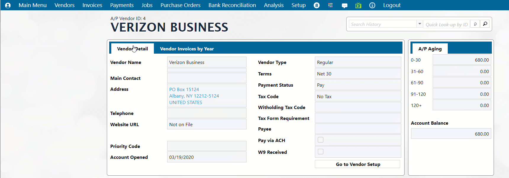
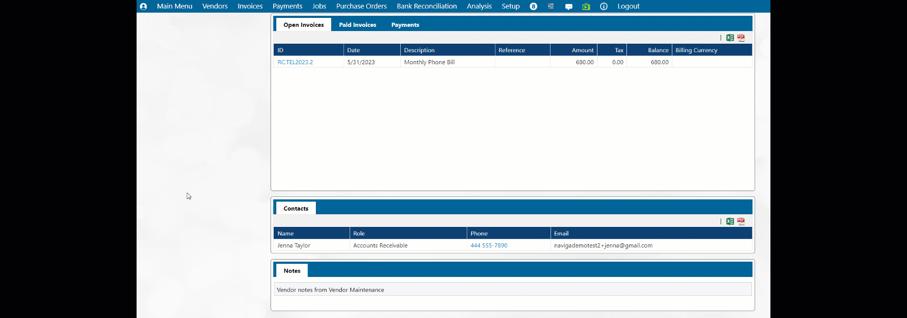

# Vendor Overview

The vendor overview search screen is the landing page when first entering the A/P Module. It can also be accessed by navigating to the menu Vendors -> Vendor Overview. If you have used the module before and have accessed vendor accounts before, the history tab will show display a list of vendors recently accessed.

If this is your first time visiting A/P and there aren't vendors in your history, or if the desired vendor isn't listed in your history, use the search fields at the top to find a desired vendor.

<figure><figcaption></figcaption></figure>

Select a vendor from either the history tab, or from the search results tab and the overview for that vendor will be displayed. The vendor details tab shows a read only view of basic vendor information. If your permissions allow, click the "Go to Vendor Setup" button in the lower right to be able to edit these details. Navigating to Vendors -> [Vendor Maintenance](vendor-maintenance.md) will also take you to the Vendor Setup screen.

The tab for Vendor Invoices by year shows a bar chart by year of the total value of the vendor's invoices. An A/P aging table to the right, shows the amount and aging of any current invoices for this vendor.

<figure><figcaption></figcaption></figure>

Below the basic information at the top are more details about the invoices and payments made to the vendor. There is a tab for open invoices, a tab for paid invoices, and a tab for payments.

Below the invoices are sections for contact people and notes. From this screen, these are read only, but if your permissions allow, click Go to Vendor Setup and add additional contact people or add/edit notes.

<figure><figcaption></figcaption></figure>

