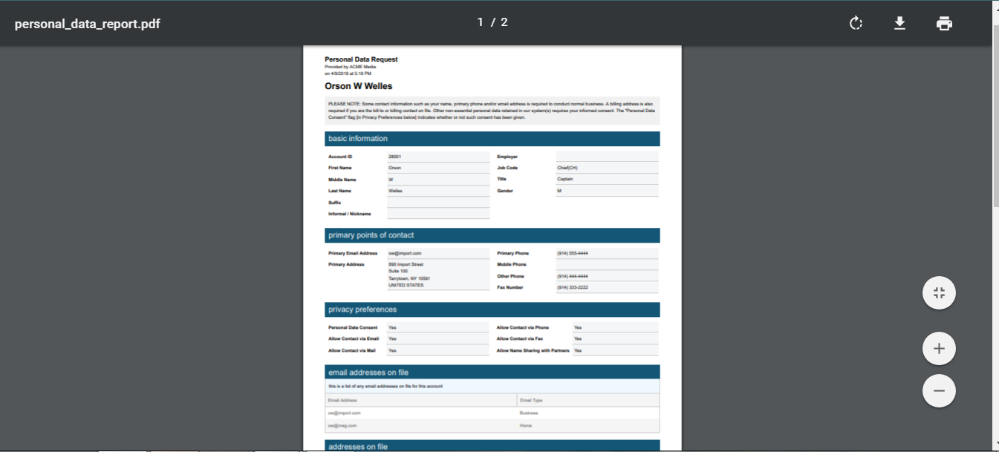
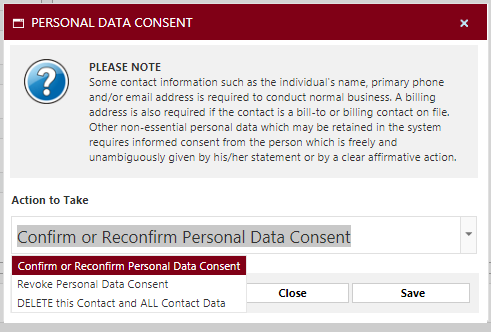

# GDPR Considerations


GDPR or General Data Protection Regulation is designed to protect individuals’ data privacy. Note that companies outside of Europe, for example, in the USA or Canada, must comply with these requirements for their contacts who are in Europe, where this rule applies.


## GDPR Overview 

A European Union requirement, known as GDPR - General Data Protection Regulation, allows an individual to inform a company that they consent to have their information stored, or revoke the consent to be communicated with by user, or be deleted completely from the system. If the contact consent has been revoked, then the system shows the individual highlighted in pink and marked with an indication that the contact has asked not to be used or contacted. Any CRM notes, actions, credit card information, listings on marketing and call lists, privacy preferences in communications, social media links information, interests and source codes for this contact are removed. If the user requests to be completely removed from the system, then they will be using the delete option and the system will keep no track of them.

## Setup 

Navigate to the Advertising module and click in the menu Customers -> Advertiser/ Agency Maintenance. Search on the individual who wants to be forgotten in your system. Scroll to the section under Privacy Preferences.

>)

These flags are set to “Yes” by default. These can be individually changed manually to “No” to protect the contact’s privacy. Save the settings which will mark this individual as such. These will change if flagged to be revoked in the Consent Data Review screen as explained below.

The field “Personal Data Consent” shows the consent status of the contact as “Yes” to allow contact or “No” to revoke consent.

Note that these preferences default values can be determined in the CRM module’s menu Setup -> CRM Settings -> Privacy Defaults. When you create a contact from the CRM module, these values will automatically apply to the contact, for your convenience.

## Contact Display 

Navigate to the CRM module and lookup the client for which this individual works. You can do so by navigating to the menu Customers -> and click on the customer’s name. Scroll to the contacts pane and click on the tab “Other Contacts for This Account”. Note that the contact highlighted in pink, and when you hover over the name, the system shows the message “This person has asked to be forgotten”.

>)

Search on that person’s name in the Customer Search screen, and the system displays a message in red to indicate that this person has asked to be forgotten.

>)

Or click the “My Contacts” if this is your customer and click the hyperlink to view the contact.

>)

## CRM List 

Navigate to the menu Customers -> My Lists. Search on the CRM List which reflects the client to which this individual is a contact. Export the details to Excel.

>)

The list of exports automatically excludes the contacts marked as forgotten from the downloaded list.

## Consent Data Review 

A customer can obtain a PDF report of their information which you have on them in Naviga at any time. To generate the report, navigate to the Accounts Receivable module and click the menu Customers -> Contact Data Review.

### View Contact ID Data 

Enter the contact ID in the field with this same name. You can perform a load-on-demand where you enter a partial or full name and the system loads the matches from which you can choose the contact. The screen then refreshes with the data available on this contact.

This information includes the contact name, whether there is consent from the contact to have and use the data, the contact’s employer and privacy preferences according to the contact maintenance settings. The information also includes the flags to allow communicating with the contact by email, phone, fax, share with other partners, or send mail. It also includes the primary address, email address and primary phone numbers.

>)

This section of the screen also contains a button to “Change or Confirm Consent”, to change the consent status, as well as “Generate PDF Report” to export the information on the screen to a PDF report which can then be sent to the client.

You can also click on “Change Privacy Preferences” button to change the individual preferences of communication with this contact. You can also navigate to the full maintenance page of this contact by clicking on the button “Go to Name Maintenance”.

Scroll to the next set of panes and the screen displays the history of personal data consent to list whether the user has asked previously to ask to be forgotten. Addresses and email addresses for the contact are listed as well.

The Basic Data Required Reasons section reflects the reason for the information on this contact to be available, such as the contact is a production contact or billing contact for orders.

>)

The next set of panes contain the contact’s social media links, the sources from which this contact was introduced to the user, other relationships which the user has with other clients such as being a contact for their orders, and any complimentary subscriptions which the contact has.

>)

The following panes display the contact’s interests which have been marked in the CRM system as Categories, all marketing lists in which the contact is included, and any CRM actions by reps to perform for this user.

>)

The following set of panes display any system generated emails which were sent to the contact because of reps’ emails through the CRM system to this contact, any previous mailings which were sent to the contact according to the CRM setup in the Mailing Lists menus, and any CRM notes which have been added by the rep for this contact.

>)

The final set of panes display the call lists on which this contact was placed as well as the history of changes made on this contact record regarding his contact information or settings preferences.

>)

### Personal Data Report Template 

You can setup the template for which to generate the PDF Report which the contact requests, or use the system provided template. To do so, navigate to the menu Setup -> Personal Data Report Template.

To view all available mapped fields which you could have on this report, click on the button “View Merge Fields Documentation”.

>)

This will open a new screen with all the available fields to use in this template.

Navigate back to the templates screen and click on the button “Create New”. Enter the Title/ Name of the template to be any text of your choosing.

>)

Scroll to the bottom of the screen and click the tab “HTML”.

Edit the HTML page to add or remove fields according to the fields you want viewed on the PDF report.

>)

Below is a sample HTML Template that can be used as a starting point.



Click on the “Save” button.

### Generate PDF Report 

To generate the PDF report, scroll to the top of the “Contact Data Review” menu screen and in the pane “Employer and Privacy Preferences”, click on the button “Generate PDF Report”.

>)

A popup screen with the template drop-down list displays from which you can choose the template or leave blank to use the system provided standard template.

Click on the button “Generate Report”. A PDF report uploads to your PC which you can then email or print and mail to share with the contact.

### Change or Confirm Consent 

#### General Changes 

When a contact asks to change their consent status, navigate to the same menu under Customers -> Contact Data Review and search for the contact ID to enter in the ID field.

In the first pane “Basic Information”, click the button “Change or Confirm Consent”.

>)

This produces a pop-up screen to take the action. Please note that some contact information such as the individual's name, primary phone and/or email address is required to conduct normal business. A billing address is also required if the contact is a bill-to or billing contact on file. Other non-essential personal data which may be retained in the system requires informed consent from the person which is freely and unambiguously given by his/her statement or by a clear affirmative action.

The pop-up screen gives user the option to 1. Confirm or Reconfirm Personal Data Consent, which will retain or change the contact status to allow user to retain, use and communicate with the contact using their personal information for any purposes; or 2. Revoke Personal Data Consent, which will change the status of the contact to “asked to be forgotten” so their personal data is obscured in Naviga. They will be highlighted in the Overview page in pink and marked as “Do Not Use”; or 3. Delete This Contact and All Contact Data, which removes the contact completely from the system where the user cannot track the consent history for this contact and the contact will not display in the contacts list for their employer if they are attached to an advertiser.

Click the “Confirm or Reconfirm Personal Data Consent” and this option will allow you to add this contact to any marketing lists, call lists, CRM notes and actions, contact information, social links, and use the contact throughout the system.

Click the “Revoke Personal Data Consent” option and click on the “Save” button.

This produces a pop-up screen with flags to allow user to choose options which prevent users and reps from performing them selectively.

>)

For example, the contact may ask to delete social media links, so user must flag this option to be “Yes”. User may ask to be removed from Call Lists or Marketing Lists. In this case, user must flag these options to be “Yes”. User may want to not be communicated with by email, mail or phone, according to the privacy settings on this contact’s maintenance screen, so user must choose “Set All Contact Privacy to No” to display “Yes”. User may not want to be used in the system for any business purposes if they left the department or changed roles, so user must set the option “Set this Contact to Do Not Use” to display “Yes”.

When finished, click on “Save”.

Note that this will not delete the contact from the system, but it will be highlighted in pink with hover text that this contact asked to be forgotten and not display the personal contact information for reps.

The system will warn reps and users to not communicate with this contact according to the specified settings.

The primary reason that this information will still be in Naviga and the contact will not be deleted is that in the future, if this contact is on another list which is imported or entered into the system where it recognizes that this is a duplicate contact and that this contact has asked to be forgotten.

Once this data is saved, when a user retrieves this contact on this screen, they can see the history of consent changes as well as the user who performed the action and the date and timestamp of when this occurred.

Note that the Consent Data Review screen reflect the consent status for each of the items flagged.

Also, the Privacy flags on the Customers -> Name/ Address Maintenance screen reflect the new consent statuses as indicated on the Consent Data Review screen.

Note that the Personal Data Consent field also reflects the consent status of this contact.

The contact is now removed from the marketing lists and call lists if they were on these lists and the settings for revocation were to remove them from the lists.

Once the contact is revoked, the contact will be accessible in the Consent Data Review screen to display the consent history of the contact.

If the contact chooses to be removed completely from the system, choose instead the third option in the Consent Data Review screen which is “Delete This Contact and All Contact Data”.

This removes any information of the contact from the system and all audit trail history record of the contact’s consent status.

## Personal Data Consent Report 

The intent of this screen is to provide a list of contacts in a date range representing the consent date, which can be downloaded to Excel, and to upload contact names from a system provided template setting the consent flag to “Yes”.

This information can be beneficial if you have a retention period of 12 months, then you can run this report for this retention period to see all these contacts which will need to be asked for consent renewal at the end of the retention period.

#### Generate the Report 

To do so, navigate to the Accounts Receivable module, Customers menu -> Personal Data Consent Report. Enter the date range of when you want to view the consenting contacts, and then click on “Select Data”.

<figure><figcaption></figcaption></figure>

The consenting contacts display with hyperlinks to the IDs and names’ Consent Data Review screen. It also provides the primary email address for the contact and the user who marked the contact in the system as a consenting contact to communicating with them as well as the date of when the consent was recorded in the system. You can then utilize the data as you wish further by exporting to Excel and PDF using the icons provided for this purpose.

## Import Consents 

The import tool enables you to import contact IDs which already exist in the system, but of only those who provided Consent for Personal Data Storage as of today.

On the same Personal Data Consent Report screen, click on the button “Import Consents from a File”.

<figure><figcaption></figcaption></figure>

In the popup screen, click on “Download Template” to open the excel template which you must fill out with the Contact/ Name IDs. These IDs are the contact IDs which exist in the system, so that the system can match them and update their consent status to “Yes”.

<figure><figcaption></figcaption></figure>

Save the file to your desktop. On the popup screen, click on “Select” and browse to the location of the template. Choose the file to upload it into the system.

Click on “Import Lines”.

Navigate to the “Consent Data Review” screen in the Customers menu, and then enter the contact ID of the imported contacts. The consent status is “Yes”.

This import will overwrite the consent values for any contacts which are already in the system. If a contact had requested to revoke consent, and you import their contact ID, their status will change in the system as consenting.

## TPS/CTPS 

TPS and CTPS Import function is a UK registry of domestic telephone numbers whose users have indicated that they do not wish to receive sales and marketing telephone calls. CTPS is similar, but for companies. This process imports Telephone Preference Service (TPS) and Corporate Telephone Preference Service (CTPS) files and flag any telephone records on file with the appropriate status. The import file should have a .TXT extension, be in fixed text format, and include the "A" (for additions) and "D" (for deletions) designation in position 13 of each line. This applies to all clients in Europe and all other companies who deal with clients in Europe.

This text file must be purchased from Newscycle MSG. To do so, please contact the help desk.

Navigate to the menu Customers -> Import TPS/CTPS Numbers.

<figure><figcaption></figcaption></figure>

Choose the import file type to be for the individual or corporate preference service. Then click on “Import”. The data is now imported and marked in Naviga with the addition or deletion mark.
