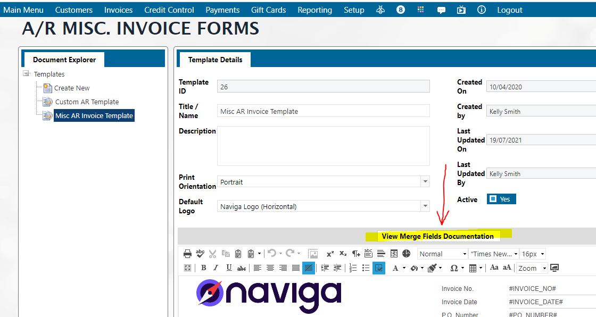

# Invoices

## Prerequisite Setup

### Class Codes 

This Setup is a prerequisite for all A/R Invoices. Navigate to the menu **Setup -> System Tables Setup -> Class Setup**. Create a Class Type by entering the Class Type ID and Description. Then click the + sign to add the information. Click “save” button.


Class Types are meant to be groupings for classes. Each Class will be linked to a Class Type. These Class Types and Classes are also used in the Production (Job Costing) Module if you are using that module.

Class Types are also an optional setting in Advertising Campaigns if you are using the Campaign Budget feature to track profitibility of Campaigns. The other option on Campaign Budgets is to use Ad Module specific "Expense Codes." The option is set in **Advertising -> Setup -> Advertising Setup -> System Parameters**.


<figure><figcaption></figcaption></figure>

Once you have Created and Saved your Class Types, click the node “Classes”.

<figure><figcaption></figcaption></figure>

Click the “New” button and enter a unique ID and a name and choose the Class Type from the drop-down menu. Keep the inactive button as no to be able to use it. Enter the appropriate G/L accounts in each field to be applied to the appropriate accounting. For example, enter the billing G/L account number, which will automatically apply the amount of the invoice being billed to this G/L account. _**Minimum requirements are the Billing G/L Account and the A/R G/L Account.**_


Other Settings at the bottom are only used if this Class is being used in Production Jobs.

If this Class is only for A/R Miscellaneous Invoices, you can leave that section blank.


#### Other Settings (Production Job use only)

Scroll to the “Other Settings” part of the screen and enter the dollar amounts for “Gross Up Percentage” meaning the additional percentage which you will charge your customers on top of the cost. This is the profit you will generate from this job.

Enter an hourly rate which you will charge for this job, and whether it is a miscellaneous charge by marking the box for this field to “Yes”.

If you click “Yes” for the field “Time-based” then this hourly rate will determine the cost of the job based on the number of hours you bill your customer. You can make that amount apply to a rep commission if you mark the “Rep Commission” field to be “Yes”. If left as “No”, the rep will not receive a commission on the revenue generated by the job attached to this class.

When finished, click save and these classes are available in the job setup menu.

Click the save button, to save the Class.

### Misc Product Setup 

Navigate to the menu item **Setup -> Misc. Product Setup**

>)

Click the + sign button and enter the Product ID and Description. The General Settings Price field is optional if there is a fixed default value to be attached with this product. Choose a Class Code you just created from the drop down menu and ensure inactive button is set to “No”. The Class Description and G/L Accounts are informational and read only from this screen.

Set the Charge Cancellation Fee to “Yes” only if you will charge a cancellation fee against this Misc. Invoice if it were cancelled. Click the “Save” button at the bottom.

Note that you can also setup the UDFs for the A/R invoicing in this screen by clicking the Text/Integer, Money/Decimal, Date or Multi-Select fields. Setup instructions can be found in [A/R Setup](../setup-a-r-system-setup/other-a-r-setup-menu-items.md#misc-invoice-user-define-fields).

### Invoice Template Setup 

Create the invoice using an HTML form. Navigate to the **Accounts Receivables Module -> Setup -> Miscellaneous Invoice Forms Template.** Click the button “View Merge Fields Documentation” and view all the HTML mapped fields which can be used in the template invoice. This requires HTML knowledge. For assistance contact Naviga Support

Copy the desired fields and paste in a new template which you can design by clicking “Create New” and then the tabs for “Design” or “HTML” at the bottom.

Here is an example template to start with.



Next step is to navigate to the menu **Setup -> Admin -> AR System Setup**.

Scroll to the ”Invoice Forms” section. Check “Yes” for Use Naviga Forms.

Choose the template you created above from the drop-down in the “Default Naviga Invoice Form”.

Enter the override Email to Address to override the email address displayed to the customer in the “From” email.


This is used only for testing purposes. It is meant to use an internal email address rather than the live customer email during setup and training exercises. This should be blank during normal live operations.


In the Email Invoice Subject Line and Email Invoice Body you can enter any text or these HTML fields: #DESCRIPTION# and #INVOICE\_NO# to reflect the invoice description and ID. Save the settings.

<figure><figcaption></figcaption></figure>

If you need to produce invoices in a different language other than your local language, proceed to add a language from the drop-down menu and use a corresponding invoice form which you have created in that language.

## Invoice Search 

The Invoice Search feature will find ALL Invoices and not just Miscellaneous Invoices

User navigates to **AR module -> Invoicing -> Invoice Search**. Search by any of the search fields below. A list of Invoice numbers, Customer name, Invoice date, Origin Description (ex. IN for Ad Bills, JC for Job Costing/Production Invoices), Currency, Period, Amount, Tax, Balance, PO. User can now drill through the invoice using the hyperlink to invoice number.

<figure><figcaption></figcaption></figure>

## List of Invoices

Search for Invoices in the system using the various options under **Invoices -> List of Invoices**

<figure><figcaption></figcaption></figure>

* List of Invoices - Allows filters by Company and Period. Allows options to view in Summary, Detail (includes expansion option to see G/L code) or it can group by G/L Revenue code.
* List of Open Invoices - Same as above, but filters out invoices that have been paid in full
* List of Invoices by Currency - Same as list of Invoices, but also includes filters for Currency and Module
* List of Invoices by Module - Same as list of Invoices, but also includes filter and Module
* Invoices by Revenue Category - Same as list of Invoices, but also includes filter for Revenue Category. Revenue Category is defined in **General Ledger Module -> Setup -> Revenue Category**, and then must be linked to the **G/L in Accounts -> G/L Account Maintenance**
* Custom List of Invoices - Most flexible search which includes all available filters
* List of Imported Invoices
* List of Service Charge Invoices - Same options as List of Invoices, but these will only show invoices for Service Charges
* List of Advertising Sales Invoices - Same options as List of Invoices, but can be filtered by Sales Rep. Only invoices from the Ad Module will be returned.

## List of Misc. Invoices by Product

User Navigates to **Invoices -> List of Misc. Invoices by Product** to query by Period, Currency, Batch, Client or Product ID. You can choose to filter out paid invoices. (Note Include Multi-Media Produts has been depricated in the Digital First version of Naviga Ad, so that can be ignored here)

<figure><figcaption></figcaption></figure>

By default, this report will be grouped by Product ID. To remove that grouping, click the X next to Product ID in the light blue heading. To group by something different, drag and drop another column header to the light blue bar.

## Disputed and Contended Invoices 

When user searches for invoices through the menu **Invoices -> Contended Invoices**, a list displays with the hyperlinks to the invoices and the details. Only Invoices marked as Contended will be displayed.

To dispute/contend an invoice, search for an invoice using the Invoice Search menu and click the hyperlink to the invoice. Then click the edit option of the invoice and choose the option “Add/ Change Contended Information”.

<figure><figcaption></figcaption></figure>

Enter the dollar amount, dispute date and reason for the dispute. Click Save. This data will display on the invoice in Other Details (shown above).

Users responsible for creating credits will review contended invoices and, where warranted, create a credit for the invoice or an adjustment for the order. The Contended information can then be edited and removed from the list once they have been dealt with.

## A/R Invoice Import 

User can import invoices which have been generated in another system. Navigate to the menu **Invoices -> A/R Invoice Import**. This process can be performed per module using the provided template. **You can also click the button “Flag Invoices as Posted to G/L”.**


This flag is the most significant difference between this import and the [Import Open Invoices ](misc.-invoicing/import-open-invoices.md#import-open-a-r-invoices)option unter the Misc Invoicing menu. Many clients bringing legacy invoices or balances over from a 3rd party system wish to import invoices as already Posted to G/L so that they don't post again.


This flag will mark the imported invoices as posted already.

The option “Use Legacy Client ID” if checked to “Yes”, will allow the system to match the legacy ID in the spreadsheet to an existing advertiser ID. If checked as “No”, the system will bypass using the legacy IDs in the spreadsheet.

Download the [template ](misc.-invoicing/import-open-invoices.md#\_toc112341274)from this screen which opens a spreadsheet. Fill out the sheet and save to your desktop. Then click the “Select” button to choose the spreadsheet and upload to the system. To flush out all errors on the spreadsheet, click the button “Test Import” and click OK if you get an error because the system will display the line and cause of error.

Correct all errors and resave to your desktop. Then click the x remove button to clear the upload then re-click the select button to upload the corrected sheet. Then click the “Import File” to complete the import file. The system will provide an ID for the import.

To view the imported invoices, user can click the node “List of Imported Invoices” and pull up the import ID and view all imported invoices.

## Import Monitor

Select desired Date Range and click Select Data to see a list of Imports

<figure><figcaption></figcaption></figure>

This is meant to just be a read-only list of imports. To see additional details, navigate to the specific import. For example, Import #224 in the above screenshot is an Advertiser Import. To see what was imported I would navigate to **Advertising Module -> Setup -> Advertisers / Agencies Import** and would look at the List of Imported Names and filter by import 224.

<figure><figcaption></figcaption></figure>

## Bulk Transfer Invoices 

### Bulk Transfer To Another Client

User can navigate to the menu **Invoices -> Bulk Transfer Invoices to Another Client,** enter a “Transfer From” client from the drop-down menu and view all invoices for this client. Then user can select one or multiple or all invoices by checking the boxes. Then user chooses to transfer the invoices to another client or another agency by selecting the respective button. The system will prompt you then to choose the new client, the reason of the transfer and the financial period to attach to the invoices.

<figure><figcaption></figcaption></figure>

### Bulk Transfer to a Collection Agency

User can navigate to the menu **Invoices -> Bulk Transfer Invoices to a Collection Agency,** enter a “Transfer From” client from the drop-down menu and view all invoices for this client. Then user can select one or multiple or all invoices by checking the boxes. Then user chooses to transfer the invoices. The system will prompt you then to choose the transfer to account, the reason for the transfer and the financial period to attach to the invoices.

<figure><figcaption></figcaption></figure>


Only Accounts that are listed as a Collection Agency will be available in the dropdown list here. Create a collection agency by navigating to **Customers -> Name/Address Maintenance** and clicking the + to create a new account. The New Record type field includes the "collection agency" record type.



## Currency Revaluation 

The process will recalculate the local value of invoices that have an outstanding balance. The transaction is revalued at the current rate on the currency code. After processing, run the Revaluation Report to see the difference. You must post this difference to the General Ledger by creating the journal entries.

Note that the currency must be setup as a pre-requisite. This is done in the **Setup menu -> System Tables Setup -> Currency Setup**. You can create the currency and its attributes and click save.

Choose the currency and the module and note the display of the exchange rate at the current value.

<figure><figcaption></figcaption></figure>

Click “Preview Invoices” to see these invoices before the report is run. This report shows the foreign balance and the local balance. The Revaluation Adjustment column shows the difference in exchange rate between when the invoice was originally valued and the current value.

<figure><figcaption></figcaption></figure>

Then you can click the “Run Revaluation” to run the report. Confirmation will display that the process is complete and you will be directed to the Revaluation Report (or can navigate to it on the left panel).


Note - Depending upon settings in **A/R module -> Admin -> A/R System Setup**, [**Email Notifications section,**](../setup-a-r-system-setup/#\_toc458780182) one or more users may be notified that the currency revaluation was completed.


<figure><figcaption></figcaption></figure>

Click on the ID to see details of the revalued invoices

<figure><figcaption></figcaption></figure>

This does not change the amount due from the customer and it does not change the original G/L amounts. This changes the Local Currency Current Value. Take this example from the above report:

<figure><figcaption></figcaption></figure>

Originally, this invoice was CA$100 and it was valued at US$80.65. Given the change in currency value over time, that CA$ is now worth only US$80.00. Clicking on the invoice ID this can be seen in the invoice details:

<figure><figcaption></figcaption></figure>

The total $587.42 must now be entered into the GL as a manual journal entry for gain/loss in currency exchange.
