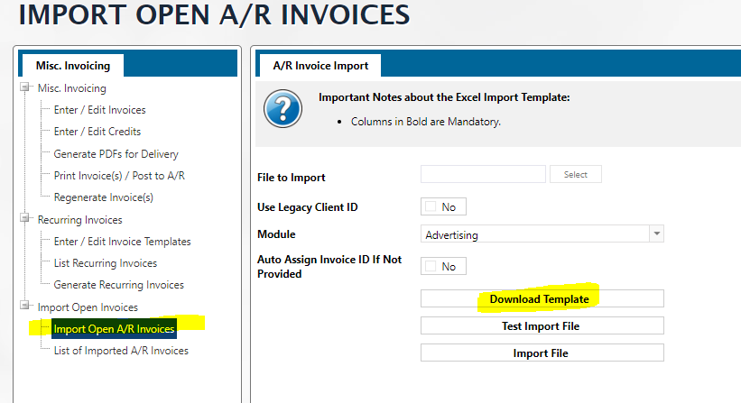

# Import Open Invoices


See Also A/R Invoices option to[ Import A/R Invoices](../#\_bookmark32)


## Import Open A/R Invoices

From the node “Import Open A/R Invoices”, you can check the box “Use Legacy Client ID” to “Yes” if you’re entering the legacy ID of client in the import template. But leave as “No” if you’re using the Naviga client ID.

Choose the Module to which this invoice belongs from the drop-down menu. You can have the system assign an ID to the invoice if you don’t enter one in the template by checking the box “Auto Assign Invoice ID if Not Provided” to “Yes”.

Download the template from this screen which opens a spreadsheet. Fill out the sheet and save to your desktop. For the template details, please see section below titled Template Fields.

Then click the “Select” button to choose the spreadsheet and upload to the Ad system. To flush out all errors on the spreadsheet, click the button “Test Import File” and click OK if you get an error because the system will display the line and cause of error.

After every error correction, resave the template to your desktop. Then click the "x remove" button to clear the upload then re-click the select button to upload the corrected sheet. Then click the “Import File” to complete the import file. The system will provide an ID for the import.

To view the imported invoices, user can click the node “List of Imported Invoices” and pull up the import ID and view all imported invoices.

Or you can click “Import Monitor” link when it displays after you perform the import.

### Template Fields 

Click the button “Download Template”.

This will open the excel spreadsheet for you to fill out. The fields are as follows:

<table data-header-hidden><thead><tr><th width="148"></th><th width="137"></th><th></th><th></th></tr></thead><tbody><tr><td><strong>Field Name</strong></td><td><strong>Sample</strong></td><td><strong>Source</strong></td><td><strong>Optional/ Mandatory</strong></td></tr><tr><td>Invoice ID</td><td>SH3232</td><td>Free form entry but cannot be an existing Invoice ID in the system</td><td>Mandatory unless the box is checked to Auto Assign an Invoice ID.</td></tr><tr><td>Client ID</td><td>244534</td><td>This value must match the Client ID in the system</td><td>Mandatory</td></tr><tr><td>Invoice Date</td><td>2/1/2023</td><td>Date format entry</td><td>Mandatory</td></tr><tr><td>Financial Period</td><td>2022-09</td><td>This value must match the financial period in the system</td><td>Mandatory</td></tr><tr><td>Currency ID</td><td>USD or EU</td><td>This value must match the currency ID in the system and can be left blank if it’s local currency</td><td>Optional</td></tr><tr><td>PO Number</td><td>444</td><td>Free format</td><td>Optional</td></tr><tr><td>Invoice Amount</td><td>3333</td><td>Free format number</td><td>Mandatory</td></tr><tr><td>Tax Amount</td><td>30</td><td>Free format number</td><td>Optional</td></tr><tr><td>Paid Amount</td><td>3030</td><td>Free format number</td><td>Optional</td></tr><tr><td>Paid Date</td><td>2/22/2022</td><td>Free entry of date</td><td>Optional</td></tr><tr><td>Advertising Product ID</td><td>AST</td><td>This value must match the Product ID in the system for a publication or digital product. This allows the invoice to be connected to an advertising product/ publication/ website for reporting purposes. Populating this field allows you to filter aging reports by product group. The aging report product group is the primary group entered on the product in the Product Setup screen.</td><td>Optional</td></tr><tr><td>Salesrep ID</td><td>SH</td><td>This value must match the Salesrep ID in the system</td><td>Optional</td></tr><tr><td>Invoice Description</td><td>Misc. order payment for last order</td><td>Free format alphanumeric</td><td>Optional</td></tr><tr><td>Due Date</td><td>08/31/2022</td><td>Date format MM/DD/YYYY of when the invoice is due to be paid.</td><td>Optional</td></tr><tr><td>Product ID</td><td>ART</td><td>This value must match the product ID in the system. The product field refers to a valid Misc. Product setup in the AR system. The product will be used to determine the GL codes on the imported.</td><td>Mandatory</td></tr><tr><td>Description</td><td>Invoice for art work received</td><td>Free format alphanumeric</td><td>Optional</td></tr><tr><td>QTY</td><td>24</td><td>Free quantity number entry</td><td>Mandatory</td></tr><tr><td>Unit Price</td><td>3000</td><td>Free number entry of unit price</td><td>Mandatory</td></tr><tr><td>Line Amount</td><td>3000</td><td>Free amount entry for this one line on this invoice</td><td>Mandatory</td></tr><tr><td>Tax Code</td><td>20</td><td>This value must match the tax code ID in the system tax setup table</td><td>Optional</td></tr><tr><td>Line Tax Amount</td><td>30</td><td>Free tax amount entry for this line on the invoice. If the tax code has a built in First Tax to Apply, then the system will calculate both taxes and display the GL codes for them on the invoice page.</td><td>Optional</td></tr><tr><td>Advertiser ID</td><td>244535</td><td>Advertiser ID in the Naviga system which is connected to the Client ID which is the agency placing the order for this advertiser. The imported invoice displays on the Open Invoice section of the Agency Overview screen displaying the Advertiser ID.</td><td>
Optional

Only used when the Client ID is the Agency Naviga or Legacy ID.
</td></tr></tbody></table>

Note that:

* Total of Line Amount (column S) of all products for the invoice should match Invoice Amount (column G).
* Total of Line Tax Amount (column U) of all products for the invoice should match Tax Amount (column G) - tax amounts are not included in Invoice Amount (column G).
* When Importing Invoices under the Import Open A/R Invoices for Miscellaneous Invoicing and choose "Auto Assign Invoice ID If Not Provided" as one of the criteria, and you’d like the system to read the data within the import template in such a way that it can consolidate multiple rows onto one invoice for a given Customer, instead of creating one invoice per row, the following steps should be followed:
  * The spreadsheet must have the total amount on at least the first invoice that in the list. And,
  * The total tax must be on the first line of the matching invoices.
  * The sum of the line amounts for the products listed against the invoice must match that from the invoice, and the total tax must match the invoice total tax.

## List of Imported Invoices 

Click this node to view the invoices you imported by choosing the Import ID from the drop-down menu. Click the Invoice hyperlink to view the invoice details including the GL codes.

<figure><figcaption></figcaption></figure>
