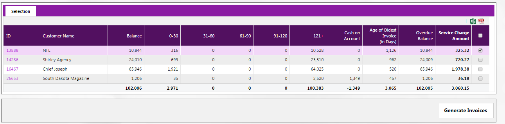
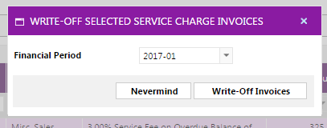

# Service Charges

## Prerequisite Setup 

### Class Setup

To setup the Class, navigate to Setup menu -> Systems Tables Setup -> Class Setup. See [A/R Invoices](./#\_toc65155656) for additional details on setting up Classes and Class Types.

### System Parameters

Navigate to the AR menu Setup -> Admin -> A/R System Parameters.

There are two options in System Parameters for setting up service charges. For Naviga accounts with just a single business entity (company), the Service Charge Percent and Service Charge Class can be used in the top section. You can also use this option with multiple companies, but only if all companies use the same % and use the same Class (remember that the class links to the G/L Codes so this option would only work if the companies shared the same Service Charge G/L code as well)

For more complex businesses with multiple companies, use the Service Charge Class per Company section and create a service charge class and Service Charge % for each Company set up in the sysem.

See [Setup ](../setup-a-r-system-setup/#\_toc458780180)for remaining options in this screenshot

<figure><figcaption></figcaption></figure>


Important Notes:

* The service charges are not printed or emailed but will appear on AR statements
* Only customers flagged to get service charges will be available for selection
* An A/R batch is created but it is not necessary to post the batch to view the statement


Scroll to the Write-off Refunds section. Enter the GL accounts for the write offs to apply.

>)

### Advertiser Maintenance 

Setup the advertiser to allow for the service charge. Navigate to the advertiser menu account maintenance and click the node “AR Setup”. Click the “Yes” button to “Service Charges”.

>)

Click the “Save” button.


The advertiser may have defaulted to having service charges or not based on their client type. Navigate to Advertising Module -> Setup -> Client Type Defaults to set the default for new clients to receive service charges.


### &#x20;

## Generate Service Charge Invoices 

Navigate to the menu Invoices -> Generate Service Charge Invoices.

If the A/R System Parameters screen has not been configured for Service Charge Classes per company, the company field can be left blank, and the system will use the default class code and percentage.

>)

If the table is established, a company code is required to determine which class code and percentage to use when generating the service charges invoices.

Choose the relevant criteria in the selection criteria section

* Choose the aging method by which you want to select your client. For example, invoices aged by invoice due date or by invoice generated date.
* Choose the option to include all clients regardless of their credit stop status, or clients who are on credit stop or clients who are not on credit stop only.
* Choose the credit controller from the drop down for which this invoice is assigned.
* Set the limits of the invoice amount.
* Choose whether or not to include the cash on account in the balance of the client. If you set the box to yes, then it will be included. If set to no, then it will not be included.
* Choose the currency from the drop down menu.
* Check the box to set it to yes to the field “Exclude Outstanding Service Charge Invoices in Calculation of New Fee” if you desire to generate new service charges invoices and not take into account existing ones. Leave as no if you want to include all outstanding service charge invoices for that client.

When finished with entering the query criteria, click on “Get Clients”.

Note that the clients are listed and each has a hyperlink available for further drill down into the customer details. Check the boxes for the clients you would like to generate a service charge invoice for, and then click on “Generate Invoices”. Enter the financial period against which you want the invoice to be recorded and the date to print on the invoice.

You will receive a message with a batch ID. Click the batch hyperlink or the OK button, and you will view the screen with the batch hyperlink for the invoices.

>)

If the batch has more than one invoice, then the invoices will display with a hyperlink to view the details.

>)

Note that the edit drop down menu is available as for any other invoice, to change the contended data, transfer the invoice to another client or agency, or write off the invoice.

You can view the service charge invoices under the Accounting tab for a customer overview page.

>)

## A/R Statement with Service Charge 

You can view the service charge invoice on the AR Statement. Navigate to the Statements menu -> A/R Statements. Generate the statement for the client and for the date range during which the service charge invoice was generated. View the batch statement in HTML form or Fabsoft form.

>)

Navigate to the Reporting menu -> AR Aging Report.

>)

Once you choose the period during which the service charge is generated, and choose the client for which the service charge invoice was generated. Click the “Get Data”. The system will display the service charge.

Similarly, you will be able to view this in the BIG AR Aging Report under the reporting menu if chosen in the same date range and for the client for which the service charge invoice has been generated.

>)

## Write-Off Service Charge Invoices 

To write off the invoice, you can choose this menu option or you can navigate to the menu Invoices -> Write-off Service Charge Invoices.

Choose the date range for which to display the available invoices. Then click on “Get Invoices”.

>)

Note that you can click on the invoice hyperlink to view. Check the box for the invoice to write off and click on “Write-off Selected Invoices”.

Select the financial period from the drop down list to write off the invoice against. At this point, you can click “Nevermind” to escape from writing off the invoice(s). Click “Write-off Invoices” button. You will receive a success message and a button to click to view the invoice.

This will direct you to the write-off refund log with a hyperlink to your write off ID.

>)

Click the hyperlink of the ID in the write-off log.

>)

The log detail will provide you with details of amount, user who wrote off the invoice, financial period, date and time of write off.

On the GL Account Summary tab, you will view the GL details of the write off process. The transaction detail tab will display the hyperlink to the service charge invoice.
