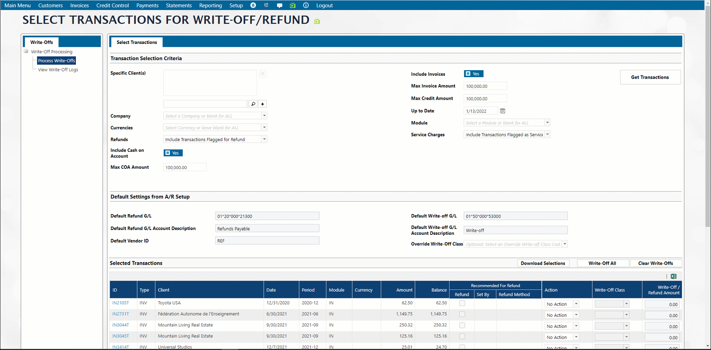
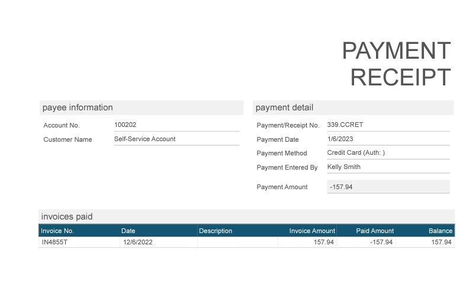

# Payments & Credits

## Finding Payments 

### Search Payments 

User navigates to the A/R module -> Payments -> Payment Search and searches by any combination of the following fields.

<figure><figcaption></figcaption></figure>

User can narrow down the search using date fields or just search by amount and bank. User can then drill down into the payment details by clicking the hyperlink on payment ID. Depending upon permissions, user can then edit the payment. For example, a check can be voided or returned.

### List of Payments

Find payments of various types with the different options on the List of Payments screens

Depending upon the information you have, you might select one of these simple options, or you might choose the "Custom List of Payments" option to have the most flexibility with searching on various search criteria combined. Search options include searching on dates, company, bank, currency, batch type, module, payment types, credit controller, batch number clients and who entered the payment. You might choose to only show cash on account or you might want to see all payments.

<figure><figcaption></figcaption></figure>

Regardless of the kind of search you run, you will see a list of payments with links to open the payment by clicking on the payment ID. The results can be expanded to see the GL codes and list of invoices that the payment was applied againt. Use the options to export by PDF, CSV or XLS formats.

<figure><figcaption></figcaption></figure>

In any of the payment listing screens, user can click the filter option, and choose criteria for filtering. User types in the box first then clicks the filter icon and chooses the filtering criteria. When done, user removes filter by clicking on the filter and choosing No filter.

## Taking new Payments in batches 

### Pay Invoice by Check (Batch) 

User can fully, overpay or partially pay for an invoice by check. User navigates to AR -> Payments -> Pay Invoice with a check and searching by customer id. User will be green for good credit or red for credit hold status. This status is set on the Customer -> Name/Address Maintenance menu. If the customer is red on credit hold, once the invoice is paid, the system will prompt user to change status of customer to good standing. If user chooses to do so, the status of the customer is automatically changed on the system turning customer to green.

<figure><figcaption></figcaption></figure>

User clicks + to add a new check (Cash on Account/Check field), enters the check no., and amount. If starting a new batch, user clicks the + next to batch no. and enters batch details. If this is not the first check of the session, the system will remember the batch you are working on. You can select a different batch when/if needed.

Payment from Bank and Date on check are optional fields if your business practice call for tracking the issuing bank and the check date.

<figure><figcaption></figcaption></figure>

The Allocate to Module or Product Group are used when running an aging report by product group or by module. Allocate to Module may be prefilled for you based on group security. Click Save to Add the check details and return to the main payment screen.


If the client is paying in Foreign Currency, select the foreign currency on the batch and the check will then display in that currency and invoices will be filtered to only include invoices in that currency.



If the Account has been configured to also pay invoices for another account, there will be an additional field on this screen where the user clicks the drop-down menu "Allow Invoices For" and chooses the other advertiser. The screen refreshes with both advertisers’ invoices.

User clicks Pay to apply the payment and receives a confirmation message when the check is fully applied.

<figure><figcaption></figcaption></figure>

Depending on users group security they may or may not be able to overpay an invididual invoice. In case of overpayment, user sees the COA amount reflecting the excess cash applied. If they are not permitted to overpay an invoice, the overpayment amound can remain as cash on account until it is either applied to a new invoice or refunded.

If user is setup in A/R -> Admin -> Group Security to be allowed to write off certain amounts during cash receipts, user can check the option to write off and click Apply. The invoice will consequently display as such. Writing off in Cash Receipts can be limited by dollar amount. For example, a cash receipts user might be allowed to write off +/- $5 in cash receipts as a small balance write-off.

At any point before the checks are allocated to the payment, user can click “Start Over” and all entries for this transaction will be reset to the last time when user saved the actions.

#### Auto Allocate 

Instead of selecting individual invoices to pay, user clicks "Auto Allocate" and w chooses date range and by parent/child. When user confirms the auto allocation, outstanding invoices will be paid from older to newer accordingly.

<figure><figcaption></figcaption></figure>

#### Voiding a payment

If the check has been saved to the batch, but has not posted to GL yet, then a payment can be voided (an edit option on the payment), which will also remove it from the batch. That is as close to deleting the payment as a user can get. The Check ID is not reusable because it still exists in the system. If the payment was otherwise correct, then user would have to re-enter it, typically using a suffix on the ID. This does not work for a Credit Card payment. It would have to be re-entered as a Check (otherwise risks double-charge).

If the batch is already posted to GL, then the Batch must be edited in TCL by Naviga Support to remove the specific Check without otherwise affecting the Payment.

#### Close and Delete Batch 

After user completes entering all payments on any batch, user can close the batch. User navigates to A/R -> Payments -> Review a Cash Batch or search payments by customer id or bank. User clicks the batch hyperlink and chooses “Yes” to close batch and save.

User can also delete a batch. User navigates to A/R -> Payments -> Review a Cash Batch. Enter a new batch, and then click Delete. A batch with payments in it cannot be deleted.

### Pay Invoice (with Credit Card)

User can apply a credit or debit card payment to an invoice if user is permitted to do so. The credit card is added to the account via the Advertiser/ Agency Maintenance screen, Cards on File node, where user can add a credit card for the advertiser. User can also add the card on the payment screen. User navigates to A/R -> Payments -> Pay Invoice(s). User searches on the customer id and selects invoices to be paid by checking the box under the “Pay” column.

<figure><figcaption></figcaption></figure>

To take payment immediately, select the "Enter Payment" option. Credit Card screen will appear, and user can select the bank and the card on file or click the + to enter a new card to use for the transaction.

<figure><figcaption></figcaption></figure>

#### Pay links

For Naviga Clients using the Client Portal, to send the customer a one-time link to pay the selected invoices, select the Send Pay Link option. You will be taken to a screen allowing you to customize the message and select who to send the email to:

<figure><figcaption></figcaption></figure>

Client receives the email and upon clicking the link, will be taken to the portal, without needing to log in, and will be able to pay the selected invoices for the specified amounts. They cannot edit the amount to pay, nor can do any other portal functions, unless they then log into the portal as they normally would.


See [A/R setup](../setup-a-r-system-setup/#\_toc124065024) to setup Paylinks


## Apply Credit 

This feature allows user to apply a customer’s available credit to an open unpaid invoice for this customer or other customers to which the customer has agreed to pay.

Navigate to the menu Payments -> Apply Credit. Pull up the customer ID and the credit note available for the customer to use.

>)

The invoices will display under the tab “Open Invoices”.

>)

From this screen, you can choose the invoice(s) you want to apply credit to by checking the Pay box. You can check the write off button to write it off fully or partially and enter the write-off amount in that box. Then click “Apply”.

You can enter the invoice number(s) directly under the tab “Open Invoices” separated by commas or semi colons or spaces and this will show this invoice(s) on top of your list of invoices.

>)

You can also lookup an invoice for another customer which this customer displayed can pay for by clicking on the button “Lookup an Invoice”.

>)

Then you can click on the button “Insert Invoice at Top of List” to move that invoice to the top of the list. This will allow you to view it on top and pay it.

>)

Another option for payment is use “Auto Allocate” button and this will apply the credit available for this customer to the first few invoices listed in the open invoices tab till that amount runs out. So, some invoices can have partial payment from this credit.

Click the “Show Filtering Option” and this will allow you to filter on any criteria to narrow down the invoice list. This is useful if you have many invoices to go through.

<figure><figcaption></figcaption></figure>

For example, enter an invoice amount in the amount box and click the filter “Greater Than”. This will refresh the screen with invoices which are greater than that amount. You can use multiple filters.

You can also view each invoice by clicking on the respective PDF icon to edit or view the invoice before payment.

## Taking Prepayments in A/R 

### Prepay an Order with a Check or Credit Card 

User creates an order which is in Confirmed status but not billed yet in the advertising system. User then navigates to A/R -> Payments -> Prepay an order with a Check (Batch) or Prepay an Order, and enters the payment information for the advertiser chosen, then clicks Pay and Apply. Payment confirmation message displays and new prepayment screen displays ready for new entry.

The procedure for taking prepayments by checks or credit cards is nearly identical to taking regular payments by check or credit card, except that the details grid here is showing unbilled campaigns rather than Invoices.

<figure><figcaption></figcaption></figure>

## Advertiser / Agency Payment Application 

Selecting Payments -> Advertiser / Agency Payment Application will first take you to a search screen where you will enter criteria like Company name, phone number, legacy ID, etc to find the desired account. Click history tab for a list of recent accounts

<figure><figcaption></figcaption></figure>

Once the account has been selected, a screen displays Open Invoices, Open Campaigns, Open Credits and Cash on Account. User can click on the .png>) icon on any line and be taked to the relevant screen to do something with that item. Open Invoice payment will take you to the screen to pay that invoice, open credit icon will take you to the screen to apply that credit, etc.

### G/L Cash Inquiry 

User can search on the cash entries by navigating to A/R Payments -> G/L Cash Inquiry to find past posted and/or unposted GL Cash entries. Select the payment id and then view details or perform further edit options. For example, user can return or void a check entry as needed. Returned checks will display as check no. appended by RET. Void checks will not display in search screens.

### G/L Cash Entry 

User creates cash entries in the A/R module by navigating to Payments -> G/L Cash Entry and enters a new check in a batch and G/L allocation mandatory fields. User can also enter more optional information such as Pub, issue, edition, section, employee, description, project, advertiser id, brand, and reps.

Note that when you enter a comment for the GL allocation, and then post the transaction to GL from the GL module, you can view and search on this comment in the GL Transaction Report as well as the Trial Balance Report.

## Write offs and Refunds 

User can write-off invoices and generate refunds of payments already made by advertisers from the accounts receivable module. Navigate to the menu Payments -> Write offs and Refunds. This can be viewed by client, and limited by invoice amount. Once the invoices display, user can check the respective boxes for the invoices to mark as refunded or written off and process the transactions by choosing the action to take on each invoice. For example, refund or write off from the action drop down menu. User can also limit the amount of the write off in the write off cell for this invoice. User then clicks on the button “Process Selections” to process the action.

User will then receive the log id and can view the write off logs also from the node marked as such. User is provided for a hyperlink to the log and view the details of the action with the associated G/L accounts.

<figure><figcaption></figcaption></figure>

To download a report of the write-off, from the Write-off Logs node, click on the pdf icon. User will be prompted to select desired template.

<figure><figcaption></figcaption></figure>

See [Write-off Report Templates](../setup-a-r-system-setup/other-a-r-setup-menu-items.md#write-off-report-templates) for details on setting up these templates.

### Setup for Write-off/Refund 

Navigate to the menu **Setup -> Admin -> Group Security -> AR Security** node and scroll to the fields in the section “Write-offs and Refunds”. In the field “Maximum Write-Off Amount” enter the amount you’d like to cap the user at for write-offs on the invoices. Check the boxes as applicable to allow for Refunds to be processed by Credit Card to refund the client the write-off on the credit card used to pay for the order or by Check Refunds. Save the settings.

Navigate to the **AR module -> Setup menu -> Admin -> AR System Setup.**

Scroll to the shutter “Write Offs and Refunds”. Choose the company from the drop-down menu. The “Write-Off G/L Account” column is intended for an expense GL Account and “Refund G/L Account” column is intended for a Refunds Payable GL Account.

<figure><figcaption></figcaption></figure>

_**If using Naviga AP Module**_**:**

Navigate to the AR System Setup menu as above and scroll to the field “Default Refund Vendor ID” in Client Defaults section. This Vendor must be set up with Vendor Type = MSC to accept multiple Secondary Vendor names and addresses. The vendor type is created in the AP module Setup menu -> Vendor Type Setup, and then associated in the Vendor Maintenance menu with the vendor you use in this step.

Navigate to the menu Customer -> Advertiser Maintenance -> Choose the advertiser and then click the AR Setup node. Scroll to the Credit Info section and enter a Refund Vendor ID. This is optional if this Customer has a dedicated Refund Vendor.

### Refund Record Selection 

Flag a transaction for refund: Credits and payments records have an Edit Option to “Recommend for Refund.” This only sets this flag for easier selection of records and does not perform any other steps toward a Refund.

Navigate to the menu Payments -> Write-Offs and Refunds. Click in the box for “Specific Client” where you can limit your selection to one or more clients. Click the + sign to add this client and repeat as needed.

The “Maximum Amounts” fields are all controlled by the Group Security setting above and can only be decreased but not increased past the Maximum defined. You can include invoices as well.

You can select any of the payment transaction returned to be processed for a refund or flagged/ unflagged for refund. Ones previously flagged for a refund have a check in the corresponding box.

<figure><figcaption></figcaption></figure>

### Write-Off Action 

Amounts written-off can be less than the balance of the transaction.

When the write-off is processed, the system creates an Invoice transaction (CM/DM) with a suffix of “.WO” applied to the selected transaction. The second GL Line will be pulled from (in order) 1. Line Item Override Code, 2. Process Override Code, or 3. AR Default Write-Off.

* Invoice written-off creates a Credit Memo with CR to receivable and DR to Write-Off GL Account (loss)
* Credit Memo written-off creates a Debit Memo with DR to receivable and CR to Write-Off GL Account (gain)
* Payment written-off creates a Debit Memo with DR to receivable and CR to Write-Off GL Account (gain)

### Refund by Credit Card Action 

This can only be used on a Credit Card Payment that was processed through Naviga in the last 2 to 180 days. Less than 2 days may not work if the Merchant Account has not yet fully recorded the original charge.

The system creates an Invoice transaction (DM) with a suffix of “.REF” applied to the selected Payment. This is a DR to Receivable and a CR to Refunds Payable (as per AR System Setup).

The system also creates an opposite Credit Memo with a suffix of “.REF.1” (CR to Receivable and DR to Refunds Payable) which is paid by a negative Payment of the same name (Check ID) that is sent for CC Processing as a Refund. The negative Payment has a CR to Cash and a DR to receivable, the opposite of the original Payment transaction.

Example of GL lines for Refund by Credit Card:

>)

### Refund by Check (without Naviga AP Module) 

The Default Refund Vendor ID is blank and at least one Bank Code (a “qualified bank”) has backend Check Parameters minimal setup. This requires Naviga Support assistance.

The system creates an Invoice transaction (DM) with a suffix of “.REF” applied to the selected Payment or Credit Memo. This is a DR to Receivable and a CR to the Refund GL Account (per AR System Setup). This is the only step, so Clients with this setup may wish to customize the Refund GL Account to meet their specific needs. This is very similar to the effect of a write-off except for the .REF suffix and the GL Account used.

### Refund by Check (with Naviga AP Module) 

The Default Refund Vendor ID is populated and at least one Bank Code (a “qualified bank”) has the full Check Parameters setup so that Checks can be printed. This requires Naviga Support assistance.

The system creates an Invoice transaction (DM) with a suffix of “.REF” applied to the selected Payment or Credit Memo. This is a DR to Receivable and a CR to Refunds Payable (per AR System Setup).

In A/P Module, the system creates an _Unposted_ AP invoice with a prefix of “REF.” belonging to the Default Refund Vendor (or direct Refund Vendor). This is a CR to Payables and a DR to Refunds Payable. This invoice will have a Description mentioning the AR Transaction ID being refunded – this is the only tie-in between AR and AP for tracing purposes. The AP invoice will use a Secondary Vendor name and address that matches the name and address of the Customer in AR (unless direct Refund Vendor). When this Invoice is paid, the final GL Lines on the Payment will be CR Cash and DR Payables, finally zeroing out all balances.

Example of GL Lines for Refund by AP Check

<figure><figcaption></figcaption></figure>

## A/R Payment Details Screen Functions 

Navigate to the menu Payments -> List of Payments and search for the payment by financial period or entry date range or deposit date range.

>)

The hyperlinks to the payments provide a drill down method which allows you to view and manage this payment. Choose the payment to be opened and click on the hyperlink. Once you are looking at the payment details screen a number of options become available. Which options are selectable will depend on your permissions and also on the current status of the payment (ie. has it been applied to invoices, has it been posted, etc)

>)

### Change COA Reason 

select Change COA Reason and a pop-up will appear with current reason, a free format field to enter new desired reason as well as Allocation options for both Module and Product Group

<figure><figcaption></figcaption></figure>

### Generate PDF Receipt

This will generate a receipt for the payment. Select desired template for the receipt (Setup receipt template in [Setup -> Receipt Template Setup](../setup-a-r-system-setup/other-a-r-setup-menu-items.md#receipt-template-setup))

<figure><figcaption></figcaption></figure>

### Unallocate Invoice Lines 

User chooses the option Unallocate invoice lines, clicks Remove allocation and saves. Allocation is undone, and invoice is listed under Unallocated Invoice list.

<figure><figcaption></figcaption></figure>

Once the payment has been unallocated, if you are then going to apply it to a different invoice, follow the same procedure above for applying cash on account in [Pay Invoice by Check (batch)](./#\_toc124065032-1) but instead of clicking the + to add a new check, select the COA from the COA dropdown.

### Transfer Payment to another Customer 

User chooses the option Transfer Check to Another Customer and saves details. A header pane displays the transfer details of the 2 customer ids, names, check number and reference number. You can only transfer the invoice to another customer if the payment has not been applied to invoices. If this option is grayed out, first select the Unallocate Invoice Lines option to undo prior allocation.

### Un/Flag for Refund 

Not all users will have permissions to actually refund a payment. If an unapplied payment needs to be returned a user can flag the payment for refund. Then allowed users can use the [Write-offs and Refunds](./#\_bookmark39) process to find requested refunds and go ahead and process them.

### Return this Check/Return this payment

Depending on the transaction type, you will either see this displayed as return this check (check payment) or return this payment (credit/debit card payment)

Enter the details for the batch to which this refund applies, and the type of refund being an adjustment or a returned payment. Save the refund and the details display on the screen including the G/L accounts with the debits, the invoice to be posted and the refund ID.

In the section “Other Information”, click the Card Transaction hyperlink to view the details on the card or check.

On the Payments Details screen, if you click the Invoice ID hyperlink, the system displays a new screen with the amount refunded with hyperlinks to the list of transactions and the original order.

>)

In the drop-down edit options for the invoice details screen, you can choose the option to generate a PDF receipt for your records. This requires that the Cash Receipts template would be setup in the system prior.

The receipt includes the payment ID.

The return transaction displays if searched on in the List of Payments screen.

>)

It can be accessed at any time with hyperlinks to the transaction.

Navigate to the G/L module and post the refund in the screen Journal Entries -> Post Transactions by Module. Choose the A/R Module related items.

>)

Click on Posting Detail in the Posting History node.

>)

Note that the posting is complete and reflects the debit amount of the refund.

Click the hyperlink to the GL account number and the transaction will be listed with a hyperlink to it.

>)

### &#x20;
