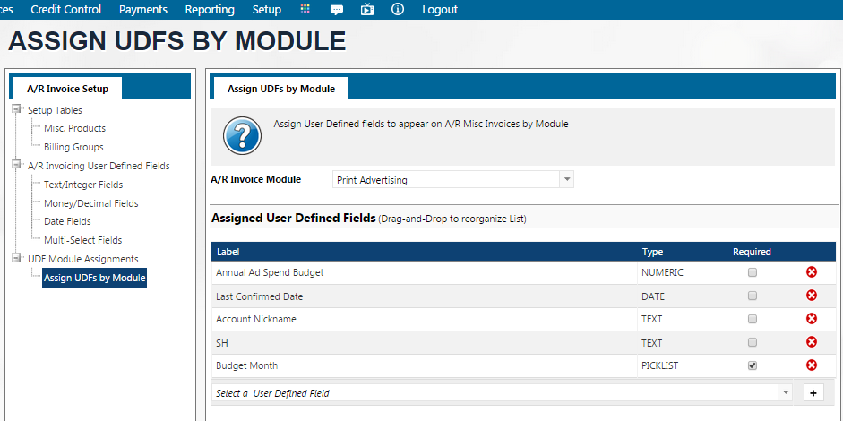

# Other A/R Setup Menu Items

## Customer User Defines Fields Setup

There are user defined fields that can be set up in A/R on the customer account. Once created, these fields can be found on the Name/Address Maintenance screen, on the A/R Setup node at the very bottom of the page. These can be text, numeric, dates or multi select fields.

1.  **Text/Integer Fields**: These are the fields which can include characters or integers without decimals. Click the drop down “Select Field ID” and choose the first available field. Enter a custom name for the field. The field can be marked as inactive if it should no longer be displayed. Leave the value options blank to have the field be a free-format field. Enter in values to have it displayed as a dropdown where the user can select the correct option.

    <figure><figcaption></figcaption></figure>
2.  **Money/Decimal Fields**: User can enter a decimal number by choosing this field. The administrator can follow the steps above to create a new field. This field, by default, allows users to enter the decimals.

    <figure><figcaption></figcaption></figure>
3.  **Date Fields**: Administrator can select a field ID and enter a label for the field, for example, purchase date.

    <figure><figcaption></figcaption></figure>
4.  **Multi-Select Fields**: Administrator can create a field where user can choose multiple values for one field. Select the free field ID, and then add the different values as in step 1. Save the UDF settings.

    <figure><figcaption></figcaption></figure>

## Personal Data Report Templates

See [GDPR Considerations](../customers-a-r/gdpr-considerations.md#\_toc51093613) in the AR/Credit Control Section

## Billing Groups

Navigate to A/R Setup -> Billing Groups to set up billing group. Then, once configured, these groups can be linked to the client in Name/Address Mainenance -> Advertising Setup

<figure><figcaption></figcaption></figure>

<figure><figcaption></figcaption></figure>

Billing Groups can be used as a filter when doing Advertising Billing or when running A/R Recurring Invoices.

## Misc Invoice User Define Fields

There are user defined fields that can be set on Miscellaneous Invoices. These fields can be text, numeric, dates or multi select fields.

1.  **Text/Integer Fields**: These are the fields which can include characters or integers without decimals. Click the drop down “Select Field ID” and choose the first available field. Enter a custom name for the field. Leave the value options blank to have the field be a free-format field. Enter in values to have it displayed as a dropdown where the user can select the correct option.

    <figure><figcaption></figcaption></figure>
2.  **Money/Decimal Fields**: User can enter a decimal number by choosing this field. The administrator can select an available Field ID and enter the field lanel in the space provided.

    <figure><figcaption></figcaption></figure>
3.  **Date Fields**: Administrator can select a field ID and enter a label for the field, for example, purchase date.

    <figure><figcaption></figcaption></figure>
4.  **Multi-Select Fields**: Administrator can create a field where user can choose multiple values for one field. Select an available field ID, and then add the different values as in step 1. Save the UDF settings.

    <figure><figcaption></figcaption></figure>

These fields provide user with customized data for the invoicing.

User clicks on the “Assign UDFs by Module”, to assign UDFs to a module. Choose the module from the drop-down menu. Select the UDF field from the drop-down menu and clicks the + sign.

User can check the “required” box to mandate the entry of the UDFs.

## Misc Invoice Form Templates

See [Invoice Template Setup](../invoices/#\_toc112341266) for instructions

## Misc Products List

When creating a Miscellaneous Invoice the user enters product codes for the billing line items. This report provides a handy list of the all the available Misc Products in case the user does not have the codes memorized. There is a filter in the white boxes at the top to assist in locating desired Product.

<figure><figcaption></figcaption></figure>

## Misc Products Setup

See [Invoices](../invoices/#\_toc65155656-1) Section

## Email / Letter Templates

See [Collection Letters](../credit-control/collection-letters.md#collection-letter-templates) Section

## Collection Setup

See [Collection Letters](../credit-control/collection-letters.md#collection-letter-defaults) Section

## Receipt Template Setup

Prior to being able to print a pdf receipt for a payment or credit, a receipt template must be created. Navigate to A/R Setup -> Receipt Template Setup

<figure><figcaption></figcaption></figure>

1. Select Create New and enter a Name for your template.
2. Optionally, enter a description
3. Choose the document size as standard Portrait size or you can set up a custom page size and margins in the css of the template.
4. Mark Active as "Yes" to enable it to be used.
5. Click the button "View Merge fields and Documenation" to see all available merge tags.
6.  Enter in the template details using the Design and/or HTML tabs at the bottom

    Click Save to save your template.

Here is a sample receipt template to get you started.



Here is a sample receipt template with a custom 3" Size



## A/R Statement Templates

See [Statements](../statements.md#ar-statement-template)

## Write-off Report Templates

Upon completion of a write-off batch in [Payments -> Write-off and Refunds](../payments-and-credits/#\_bookmark39), user will then receive the log id and can view the write off logs also from the node marked as such. To download a report of the write-off, from the Write-off Logs node, click on the pdf icon. User will be prompted to select desired template. To create the Template that will be used here, navigate to Setup -> Write-off Report Templates or Payments -> Write-off Report Templates

<figure><figcaption></figcaption></figure>

1. Click Create new
2. Enter in desired Name
3. Enter in optional Description
4. Mark as "Active" to be able use the template
5. Click View Merge Fields Documentation to see all available Merge Fields
6. Using the Design/HTML tabs at the bottom, design your template. A Starter template is provided below



## Client Group Setup

Client Groups can be setup and used in the Client Budget Report and also in A/R [Auto-Clear Client Balances](../statements.md#auto-clear-client-balances). To setup client groups Navigate to Setup -> Client Group Setup

<figure><figcaption></figcaption></figure>

Click "New" and enter an ID and a description for your client group.

Click the search icon at the bottom of the screen to find an account to add to the client group. Click the plus sign to add them to the list.

Alternately, Navigate to the Name/Address Maintenance screen and add the client group to the customer record on the A/R Setup node. If using Client Groups in Auto-Clear Client Balances, this is the preferred method since it is also where you are adding the Auto-Clear Balance credit card details.

<figure><figcaption></figcaption></figure>

## Revenue Categories

See [Client Ranking Reports](../reporting/#\_toc124065029-1)

## Account Alert Type Setup

Navigate to Setup -> Account Alert Type Setup.

<figure><figcaption></figcaption></figure>

Create one or several Alert Codes and Descriptions. Click the + to add the list

Click Save.

These alerts are setup on the Name/Address Maintenance view of the account on the Account Alerts node. They are then displayed as a popup whenever a user opens the account in the system.
