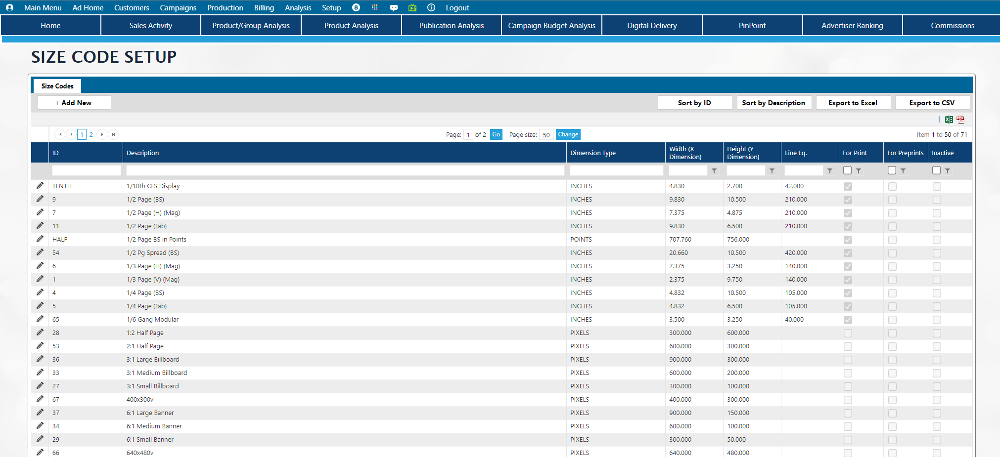

# Price Adjustment Import

### Import option for Price Adjustment Setup

Navigate to **Setup -> Product Setup** and select the new "**Price Adjustments Import**" option to import Adjustment codes for products.

<figure><figcaption></figcaption></figure>

1. Click the button to Download Template to get the excel file needed to import adjustment codes.  Fill in adjustment codes according to the following template fields:

<table><thead><tr><th>Field</th><th>Example</th><th width="311">Description</th><th>Required?</th></tr></thead><tbody><tr><td>Product ID</td><td>DEMO123</td><td>Alpha-Numeric field representing the ID for the Product</td><td>Yes</td></tr><tr><td>Description</td><td>Premium Surcharge</td><td>Alpha-Numeric field used to describe the adjustment. This is what the user will see when selecting an adjustment in order entry and what the customer may see on the invoice/order confirmation</td><td>Yes</td></tr><tr><td>External ID</td><td>ABC123</td><td>Alpha-numeric field which may be used in interfaces to external systems</td><td>Optional</td></tr><tr><td>Allow Description Override</td><td>Y</td><td>This is a Y/N field to indicate if the Description can be overwritten by a user in order entry screen.</td><td>Optional.  If left blank and answer of No (unchecked) will be applied.</td></tr><tr><td>Plus/Minus</td><td>-</td><td>+/- field which indicates if the adjustment should be positive (surcharge) or negative (discount).  If left blank, the user will be able to select a positive or a negative adjustment in order entry</td><td>Optional</td></tr><tr><td>Type</td><td>GROSS</td><td>These are hard coded options in the system.  Use the following to indicate the correct option: GROSS = Percent of Gross NET = Percent of Net AMOUNT = AMOUNT</td><td>Yes</td></tr><tr><td>Prompt for Value</td><td>Y</td><td>If set to Yes (Y) the user will be allowed to enter in a value for the discount during order entry.  If set to No (blank or N), the value will need to be set in the "Value" field</td><td>Optional</td></tr><tr><td>Prompt for Qty</td><td>Y</td><td>Only valid if the Type is set to AMOUNT. If type is AMOUNT, this can be set to Y for Yes or it can be blank or N for No. If Type is GROSS or NET, this should be left blank.</td><td>Optional</td></tr><tr><td>Value</td><td>-50</td><td>If the plus/minus field is negative, this must also be negative. If Prompt for Value field is Y, this should be left blank.</td><td>Optional, but if Prompt for Value is No, this should be filled in with a value</td></tr><tr><td>Hide on Forms</td><td>Y</td><td>Y for Yes, N or blank for No</td><td>Optional</td></tr><tr><td>Currency</td><td>POUND</td><td>Only use this for <strong>foreign</strong> currencies.  For amounts in the system's default currency, this should be left blank.  </td><td>Optional, but if used the currency ID from currency setup is what is expected here.</td></tr><tr><td>Ad Type(s)</td><td>CPCI,DCI</td><td>This will allow the adjustment to only be available for certain ad types.  Leave blank to allow for all ad types. Multiple ad types can be entered and comma separated</td><td>Optional, but if used, the values entered here must match the Ad Type ID's in Ad Type setup</td></tr><tr><td>Plan Position Code</td><td>FIRST</td><td>Used for Sorting in Naviga Plan. See <a href="price-adjustments.md#plan-position-code">Price adjustment Setup</a> for details</td><td>Optional. Leave blank if not using Naviga Plan</td></tr><tr><td>Section(s)</td><td>NEWS,LOCAL</td><td>This will allow the adjustment to only be available for certain sections.  Leave blank to allow for all sections. Multiples can be entered and comma separated</td><td>Optional, but if used, the values entered here must match the section ID in Product Setup</td></tr><tr><td>Position(s)</td><td>BP</td><td>This will allow the adjustment to only be available for certain sections.  Leave blank to allow for all sections. Multiples can be entered and comma separated.  If Positions are defined within a section according to product setup, then the section must also be entered on the template for position to be accepted.</td><td>Optional, but if used, the values entered here must match the Position ID in Product Setup.</td></tr><tr><td>Override G/L Account</td><td>01*002*123*1234</td><td>This will allow the Adjustment to be applied to a different G/L than the revenue for the order line.  See <a href="price-adjustments.md#override-g-l">Price Adjustment setup</a> for details on using this optional field.</td><td>Optional, but if used it must match a G/L code defined in the G/L setup</td></tr><tr><td>Application Rule</td><td>LAST</td><td>This is only used in Booking Wizard order Entry and allows for the adjustment to be applied only to the First insertion, Last Insertion, or All insertions.  Valid options here are FIRST, LAST, and ALL.  A Blank will assume all insertions.</td><td>Optional</td></tr><tr><td>Inactive</td><td>Y</td><td>Leave blank for No.  This sets the Adjustment code to Inactive if set to Yes.</td><td>Optional</td></tr></tbody></table>

2. Once the spreadsheet is filled in with your data, save the file to your computer or desired network location.
3. Click the Select button and navigate to the file location&#x20;
4. Click test import file.  The system will do a test import and will notify the user if there are any errors in importing.  If there are no errors, skip to step 8
5. Open saved spreadsheet and correct any errors, and resave
6. Remove the original uploaded file by clicking the X remove\
   .png>)
7. repeat steps 3 - 6 until all errors are resolved
8. Click Import File to run the actual import process.
