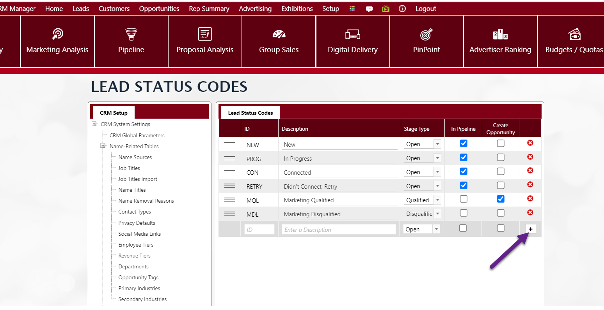
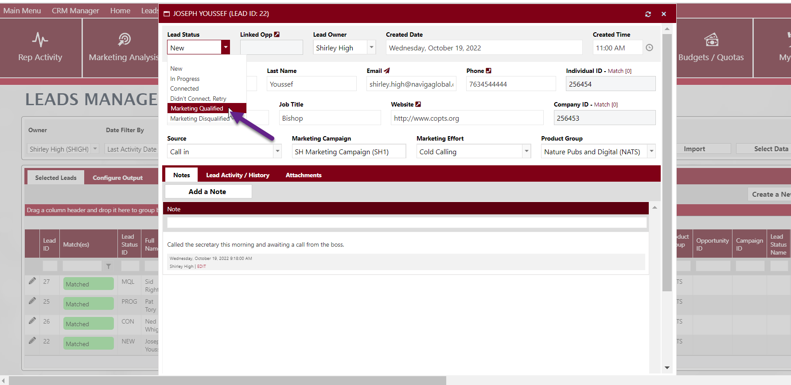
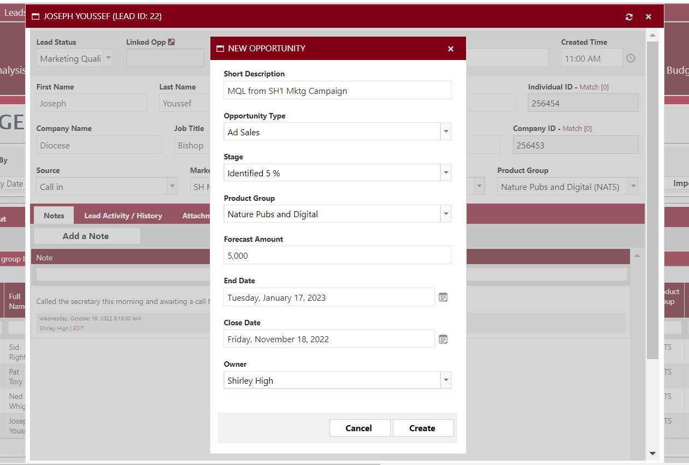

# Leads

This is a precursor to these leads becoming opportunities and accounts. The screens allow for creating the lead, assigning the lead to a system user, creating potential opportunities pipeline for the leads, and finally tracking the progress of the sales leads being qualified to move forward or disqualified to be removed. A dashboard is provided for a quick management of leads.

Please also see the below video excerpt from the 2022.5 New Features webinar where we introduced this part of the CRM module for the first time.



## Lead Status Code 

This screen allows you to create the codes which provide tracking of each lead’s status to indicate their stage in the sales life cycle.

Navigate to the menu Leads -> Lead Status Codes Setup. This is the same menu as in Setup -> CRM System Settings -> Other Tables -> Lead Status Codes.

Enter an ID, Description for the status to indicate the state of the lead. For example, New, In Progress, Cancelled and so forth.

Choose the Stage Type, to match the description of the status. The Stage Types are hard coded values in the system of “Open” which means the lead is being introduced into the system, “Qualified” meaning the appropriate departments of sales and or marketing deemed the lead valid and viable, and “Disqualified” meaning the marketing department deemed the lead invalid to proceed.

Check applicable flags for In Pipeline, meaning display it in the Pipeline for follow-up purposes or not, and same for the flag Create Opportunity meaning to allow for creating an opportunity based on this status. Repeat adding various status as applicable and then click the + to add. When finished, click the Save to store the codes.

## Leads Dashboard 

This screen can be used to assign leads to members of the marketing team.

Navigate to the menu Leads -> Leads Dashboard. Click “Create a New Lead”.

<figure><figcaption></figcaption></figure>

Enter the data in all fields as much as possible to make the lead record meaningful. You can edit to add more details later. The lead owner field provides a list of system users from which you can choose including yourself.

Marketing Effort values are determined in a table in the menu Setup -> CRM System Settings -> Marketing Effort. Source values are determined in Setup -> CRM System Settings -> Name Source.

The lead can be attached here to a Company or Individual by clicking the Match hyperlink next to the Company of Individual fields. If the lead is not a company or individual or attached to an individual or company in Naviga you won’t be able to create opportunities and proposals for this lead at this point, but the lead will remain in the system to manage.The Match works based on an email address if you click on “Individual Match ID” and by Website address if you click “Company Match ID”.

>)

You can then check the box(es) of any of these matches to attach them to the lead.

Or you can create a new account to attach it to the lead. This creates a new advertising account in the system. The advertising account created will carry this lead’s name as a contact on the advertiser record.

Click Create a New Account and you can choose one of three options:

1. Create a New Company – This would create a new account in Naviga.
2. Individual is a Direct Buyer – This will create this lead as an individual. Note that even if this is the case, this individual’s account ID becomes the Company Account ID to be able to place opportunities and proposals for this account.
3. Match to Existing Company – When you search on this account, you can then attach to an already existing account in the system. You must have a valid Company or Individual ID in the Lead record which matches one in Naviga.

>)

When you proceed to the final tab “Validation”, this tab double checks Naviga to search for duplicates and alert you so that there would not be duplicates in the system and cause inaccurate reporting.

You can use the Attachments tab to bulk attach or single file attach important documentation to the lead account.

Changes made to the lead account will be tracked in the tab “Lead Activity or History”. Also, you can enter typed notes in the Notes tab.

Note also that there’s the tab “Other Matching Leads” where the system lists other instances where this same Lead was in the system. This can indicate that some leads are “hotter” than others. For example, you might have imported that lead in from meeting them at a conference, perhaps they also visited your website and filled out a request for information and perhaps also came in from an additional source.


Also Note: Even when you have linked a lead to an individual and/or a company that exists in the system, the lead details shown here as far as Company Name, Job Title, & Website will remain whatever was imported in with the lead. We don't overwrite that info.

Typically, once the lead is matched and validated as a lead by marketing, an opportunity is created and assigned to a sales rep to progress further. The lead individual is linked to the opportunity as the contact person and the opportunity itself is tied to the company account. The sales user can click on the person's name in the contact grid to see additional details about that person.


The user can remain in the leads edit window and click Next and previous at the bottom of the window to work through a list of leads without returning to the main dashboard to select the next lead in the list.

>)

Back on the main Leads Dashboard, you can search on leads using any of the search criteria at the top.

<figure><figcaption></figcaption></figure>

This can be by Owner Name, and Dates or Marketing Campaign, or Product Group and so forth depending on the data you stored on the lead record.

>)

You can also use the Configure Output tab to add more columns to display all data related to the lead as needed.

On the On Screen Columns side, highlight the fields you’d like to add from the “Available Grid Columns” and click the right facing arrow to move them to the “Selected Grid Columns”. Then click Save Configuration. You can repeat with the Excel Output side as well.

Note that you can use the “Import” button, then download a template, fill out multiple rows and import all the data in bulk. The fields are all optional and highlighted yellow fields must match values already in Naviga. Save the template on your desktop.

>)

Browse to select the saved template and select it and then click “Import Leads”. Once the file is imported the data displays and can be managed moving forward.

### Bulk Assign Lead Owners 

<figure><figcaption></figcaption></figure>

You can bulk-assign lead owners to imported leads by clicking on Assign Lead Owners and selecting one or more users to change owner from and to. Leave “Change own from” blank if you want to assign unassigned leads to one or more people.

Also, on the import leads template and in the Leads API, there is now an owner ID field so that you can assign specific users as part of the lead creation process.

## Leads Qualification Pipeline 

This screen is similar to the Leads Dashboard screen with more visual graphics and tables for organizational purposes. Leads Qualification Pipeline can be used by managers or lead owners to use while they are qualifying the lead.

>)

## Leads Lifecycle Pipeline 

Once a lead is qualified by Marketing, the lead then is transferred over to sales as an opportunity. This is where the Lifecycle Pipeline screen can be useful, especially for team members who would like to analyze the leads overall from Lead to Cash. You can see the entire lifecycle of that lead in this screen. How many leads came in from Source XYZ, how many ended up as Marketing Qualified, how many of those then became Sales Qualified Leads and became an Opportunity and at what value. Then for those who ended up with a proposal, how many of those ended up turning into real orders, and for how much revenue.

>)

The settings are derived from the Opportunity Stages in the menu Setup -> Opportunity Configuration -> Opportunity Stages.

<figure><figcaption></figcaption></figure>

Choose the opportunity type, stage and you can then define each stage with a corresponding Lead Qualification value and Stage Type being Open, Lost or Won. These values will display on this screen depending on the stage of each opportunity.

Navigate to the menu Leads -> Leads Lifecycle Pipeline and search by the criteria provided.

Note the bottom section which is divided by the Leads by Source and the other side Leads by Marketing Campaign.

There is also Informer reporting available.

## Marketing Campaign Performance 

This displays the leads brought in through marketing campaigns.

You can create the Marketing Campaign in the menu Leads -> Marketing Campaigns Setup.

>)

In the Opportunity Defaults section, you can place all default values which would auto-populate fields when you turn a lead into an opportunity. For example, the description, the Stage of the opportunity, the value and End Date Offset days, meaning the default End Date of the opportunity which is the number of days from the creation date of the opportunity, and the Close Date Offset in Days, meaning the Default Close Date in days from the day the opportunity was created. Once you attach Leads to a marketing campaign, that data will display here in the Leads tab.

Navigate to the menu Leads -> Marketing Campaign Performance. Search on the marketing campaign.

>)

Click the tab “Leads”. The data displays the leads attached to this marketing campaign.

## Create an Opportunity from Leads 

As a prerequisite, the lead must be attached to a valid Company or Individual ID in the system, meaning the lead must be attached to an advertiser in Naviga. So, the Company ID or Individual ID must be valid values in Naviga as a New Account when you click Match ID or an existing account.

Navigate to the menu Leads -> Leads Dashboard and search on the leads you’d like to transform into an opportunity. Click the Lead Status ID.

In the pop-up screen, click on the Lead Status drop-down menu. Choose the status which is setup as allowed to create an opportunity according to the Lead Status Code table above. For example, the Marketing Qualified.

Choose the Marketing Qualified status and the system prompts you to create an opportunity.

Confirm by clicking on Yes and the pop-up screen to enter the new opportunity details displays. Click Create.

>)

The field “Linked Opp.” is populated with the Opportunity ID. Click the arrow next to the field and the opportunity screen opens up with the details.

The opportunity screen contains a section listing the lead name. That opportunity can be changed to be a proposal from within the opportunity and go through the life cycle of an order. See [Opportunities](opportunities.md) for more info on Opportunity Workflow
