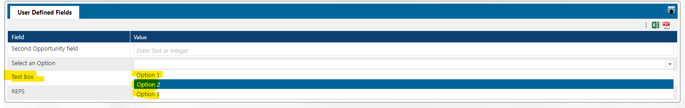
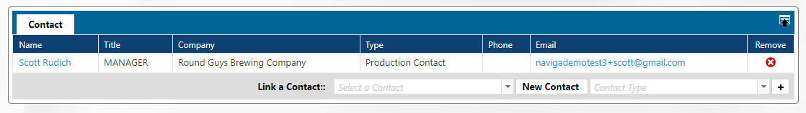

# Opportunities

This page will show how users can create CRM opportunities including the setup involved to use all features of opportunities. Sales reps, sales managers or sales assistants can create and manage CRM opportunities. Creating an opportunity is beneficial for reps when they have large scale sales proposals that will be negotiated over time. Creating an opportunity will help the rep record and manage progress details and possibly convert them to proposals.

## Opportunity Setup 

Naviga administrator can setup Opportunity Types, Stages and Master Stages in Opportunity Configuration. Navigate to the following in the CRM module -> Setup -> Opportunity Configuration.

### Opportunity Types 

In previous versions of Naviga Ad, the Opportunity types were hard coded as Advertising, Exhibitions, or a combination of Advertising and Exhibitions. This has been changed in 2023.1 and is now configurable. When upgrading to 2023.1 a conversion will automatically run and will create those three Opportunity Types and any existing opportunities will be assigned to those types based on what type they were assigned when the opportunity was created. Additional Opportunity Types can be added by typing in the ID and Description and clicking the plus to add it. Click and drag the three lines to the left of the opportunity type to reorder into your preferred sort. Save the changes.

>)

### Opportunity Stages and Master Stages 

Opportunities are defined by stages, according to the status of the negotiations with the client. For example, a stage can be in the beginning stage of cold calls and might be given a weight of 10%, then moved to a more advanced stage as talks progress to 25% and so forth. Each stage can be defined by a name which the user can choose in the opportunity screen. Each Opportunity Type can have its own unique stages. To allow for reporting across all Opportunity Types, each Opportunity Type will also be linked to a Master Stage.

First, Create the Master Stages:

<figure><figcaption></figcaption></figure>

1. Enter an ID and a Description for the Master Stage
2. Check the box if you wish for this stage to be included in the pipeline. You may wish to exclude some stages from the pipeline, for example lost or won stages.
3. Select the Stage type (Open, Won or Lost)
4. Select the Lead Qualification for this stage (Open, Qualified or Disqualified. For those using leads to track pre-opportunity sales progress)
5. Enter the probability of the deal closing
6. Click the plus sign to add to the list and repeat above steps until you have all necessary stages created
7. Drag and drop the 3 lines >) to arrange the sort order for these master stages.
8. Save

Once you have created the Master Stages, then create the Opportunity Stages.

1. Select the appropriate Opportunity type at the top
2. Enter an ID and a Description for the Master Stage
3. Check the box if you wish for this stage to be included in the pipeline
4. Select the Stage type (Open, Won or Lost)
5. Select the Lead Qualification for this stage (Open, Qualified or Disqualified)
6. Select the appropriate Master Stage to display when viewing all opportunity types together in a report.
7. Enter the probability of the deal closing for this stage
8. Click the plus sign to add to the list and repeat above steps until you have all necessary stages created
9. Drag and drop the 3 lines >) to the left of the stage to arrange the sort order for these master stages.
10. Save
11. Repeat these steps for each Opportunity Type that you have created.

<figure><figcaption></figcaption></figure>

### Opportunity Pricing 

This is default Exhibition pricing of an opportunity. The Ad pricing is determined while creating the opportunity products for a campaign. Click the node Opportunity Pricing – Exhibition. Click the dropdown menu to choose the exhibition to use in the opportunity. Choose the space type and unit pricing and save the settings.

This will force the price to display as chosen here for this matching type on the opportunity page

### User Defined Fields 

An Administrator can setup the user defined fields which user chooses in the opportunity screen. These can be text, numeric, dates or multi select fields. To do navigate to the CRM menu Setup -> Opportunity Configuration-> User Defined Fields and expand the + sign next the node.

1. **Text/Integer Fields**: These are the fields which can include characters or integers without decimals. Click the drop down “Select Field ID” and choose the first available field. Enter a custom name for the field. If you wish for this field to display as a multi-line text box, click Yes for Allow Multi-Line Text. The field can be marked as inactive if it should no longer be displayed

For example, the screenshot below shows some options. In the value field enter “1” and then a description “Option 1”. Click + to add. Repeat the step by adding other values and save.

>)

Navigate to the opportunity screen and note the UDF listed for user to choose any value from the ones created above.

User can also use the field to enter a free entry form for a numeric or text entry which has no options to choose from. To do so, choose a field ID which is not occupied, then enter a field name only. For example, budget.

>)

Navigate to a new opportunity, and note the new field listed allowing the user to enter a free form, even numeric but without decimals.

>)

2. **Money/Decimal Fields**: User can enter a decimal number by choosing this field. The administrator can follow the steps above to create a new field. This field, by default, allows users to enter the decimals.

>)

3. **Date Fields**: Administrator can select a field ID and enter a label for the field, for example, purchase date.

>)

This will appear on the opportunity screen as a calendar pop up for user to choose from.

>)

4. **Multi-Select Fields**: Administrator can create a field where user can choose multiple values for one field. Select the free field ID, and then add the different values as in step 1. Save the UDF settings. Navigate to the opportunity screen and note that the values created are all listed as check boxes to choose one or all.

>)

Save the values on the opportunity.

## User Defaults 

Naviga administrator can setup many of the fields in opportunity screen to default or to be entered by the user. Opportunity required fields can be set under Group Security.

### Default Opportunity Type 

Navigate to the menu Setup in the CRM module -> User Security -> Access Control node. Click the drop- down menu Default Opp. Type and choose the type. The types displayed in the dropdown will be dependent on the types of opportunities setup previously.

>)

Save the settings.

## Create CRM Opportunity 

To create a new opportunity, navigate to the CRM module. Click on Opportunities menu and select “Enter a New Opportunity.” A default opportunity type can be setup in CRM security menu by your admin.

Opportunites can also be created by copying another opportunity. This can be accomplished in one of two ways, depending upon user preference.

1. User starts a new Opportunity and references the old Opportunity ID



2. User opens the original Opportunity and creates a copy of it



Each section on an opportunity can be expanded or collapsed by the user. They can also be reordered by dragging and dropping the section to a different location on the page. For Example, if there is a section that you to not typically use, you can collapse it and place it at the bottom of the page, so it isn’t taking up unnecessary space when you are working.

#### Basic Information

In the header of the opportunity, enter the customer id, and brand. If the brand is tied to an agency, the Agency field will automatically populate the agency information. If appropriate, select a Call List and/or Marketing Campaign (may be filled in automatically if the Opportunity was created from a call list or marketing campaign).

Depending on security, you may also click to create a new brand for this advertiser by clicking on the button next to the field “Brand”. You can then use this brand in creating the opportunity.


Note - this is using the same permission as being allowed to create brands on a campaign. So if they user can create brands in order entry, they also can create them here. If they cannot create brands in order entry, they will not see the Create a new Brand link here either. The customer also must be a customer who uses multiple brands to be able to see the link.


#### Valuation

Enter a forecast amount you anticipate being the value of this opportunity or leave blank and when done with the product details, you can click the Calculate button and the system will automatically update with the added values from all the products’ pricing. This will include all amounts added in the Groups, Products and Exhibitions sections. Select a currency if different from the system’s default currency.

<figure><figcaption></figcaption></figure>

Choose the desired Values for Reporting option:

* Use the Forecast Amount across start /end date range: Use the amount in the Forecast Amount field.
* Use the Product Grid: Uses the sum all the lines in Product grid below.
* Use the Selected Proposal/Quote: Choose checked line on Proposal grid

The value selected here will determine which value is used in the Sales Rep Activity page for the Opportunity line.


See [2023.1 Release Guide](https://docs.navigaglobal.com/navigaad/v/advertising/welcome-to-naviga-ad/release-guide) for additional details and examples of the above valuation options.


<figure><figcaption></figcaption></figure>

If the person entering the opportunity is a salesperson, their name will default into the opportunity owner field. The names displayed in the dropdown list are controlled by whose opportunities the user can access. User security -> [CRM access control](../system-settings-admin/security/user-admin-security.md#crm) -> team access, "view opps" column. (and for 2023.3 we added a "created by" field)

<figure><figcaption></figcaption></figure>

Choose the stage which this opportunity is in today. This value can always be updated as needed. The probability is tied to the stage in Opportunity Stage Setup. This value may or may not be able to be overwritten depending on the group security of the user.

If desired, enter one or more tags for the opportunity. Tags are used as filters on the Quick Update or Taskboard screens to allow reps to filter their opportunities by specific tags. Standard tags can be setup by an administrator in CRM Setup > CRM System Settings > Name-Related Tables > Opportunity Tags. A rep can also manually add a tag in the field if desired.

#### Dates

Enter the Start and End Date range for when the opportunity is valid. Dates entered here may affect the financial period(s) where the Opportunity amounts are displayed in the Rep Activity report displayed above (depending upon the Values for Reporting Selection made).

Enter the close date which is the date when you expect to have the final decision on the opportunity. Close date may or may not be required depending on your group security and it can also affect if the opportunity amount is displayed in the Rep Activity report.

#### Description of the Opportunity

Enter a short and long description indicative of the opportunity. Short Description is required to save. Long description is optional.  The Short Description will become the Campaign Description for any Opportunities that become proposals / campaigns.

#### Associated Lead(s)

If the opportunity was created from a lead, the linked lead will be displayed here. Click on the pencil icon to view/edit the lead details.

>)

#### Advisr Linked Campaign(s)

If you are integrating with Advisr for proposal building, you can click to create a new Advisr Campaign or edit an already linked Advisr Campaign.

#### Forms

Custom forms can be configured to use on Opportunities. These are configured in Advertising Module Setup > Custom Forms Setup. Only forms with the form type of CRM Opportunities will be available to use in Opportunities. Forms can be used to add a set of questions to an opportunity.

Click “Add a Form” and select desired form to use. Fill in the fields on the form and click save. To edit an existing form, click on the ID, Form ID or Form Description to re-open the form and made necessary changes.

If an opportunity is converted into a proposal/campaign, any opportunity forms will be available on the campaign as custom data forms. This will be displayed in a Opportunity Forms section on the Campaign Custom Data Forms node.  IMPORTANT - this is NOT a COPY of the Opportunity form, so any changes made to the form here will also change the form on the Opportunity as well.  If multiple campaigns are created from the Opportunity, the same single form will be displayed on each of the campaigns.

#### Products

In the Products section, select the product in the drop-down menu and click the + to add to the opportunity. Select the Ratecard in the drop-down menu, choose the ratecard line, section/position, the start / end date, the AD Type, the rate amount, and the quantity. The price is calculated based on the rate x quantity.

Repeat the process adding multiple products as needed or select a package to add multiple products simultaneously.

When you choose a digital product in the drop-down menu, you can split digital products lines by month, with similar split options as per the line items.

#### Groups

You can add a group in the “Add a Group” drop-down, if you know what product group will be sold, but don’t yet know which products.

#### Proposals and Campaigns

In the “Proposals” shutter, you can click the “Link an Existing Proposal” and choose an existing proposal to attach this opportunity. Or you can click the “Add New Proposal” and the system redirects you to add a proposal.

The proposal has the default data from the opportunity regarding the advertiser and brand information.

Once finished, click the “Go to Opportunity” on the tree.

If you had added products in the Product section above, instead of selecting “add new proposal” you may instead select “Auto Generate New Proposal”. The system then creates the proposal using the product information in the opportunity.

In the valuation section above, if you elected to use the selected Proposal amount for the Opportunity value in reports, be sure to also check the appropriate line item in Proposals & Campaigns grid.

>)

#### Exhibitions

If this is an exhibition opportunity link an exhibition by selecting the show in the dropdown and clicking +. Enter the Section, Space Type and Quantity to calculate the amount.

>)

#### Contact

Choose a contact from the drop-down menu, including contact type, if desired, and click +. If the contact person is not already in the system click New Contact to create a new contact name record.

In [CRM Parameters: Contact Types](setup/crm-system-settings.md#\_toc120632517), there is a flag "Transfer to Campaigns" which controls which contact types will be sent to the Campaign if a proposal is created from this opportunity.

#### To Do

Scroll to the shutter “To-Do”. Click the “Add a New To-Do Action” to add a new to-do task. To edit an existing to do, click on the action and make necessary changes. Completed actions related to this opportunity will be on the “Done” tab.

<figure><figcaption></figcaption></figure>

#### User Defined Fields

If an admin created any user defined fields in the setup, they will be displayed in this section. If you don’t use any user defined fields, you can collapse this shutter and move it to the bottom of the page if desired.

#### Attachments

You can also add links or file attachments to the opportunity such as relevant URLs or contracts or any documents. Click the + sign after each addition.

Attachments on the Opportunity will transfer over to the campaign and become campaign attachments, if the flag is checked for the Attachment to transfer to the campaign - we don't want to assume that all opportunity attachments will be relevant to the campaign.\

<figure><figcaption></figcaption></figure>

When finished, click the “Save” button.

#### Opportunity Confirmation Forms

This is a new concept in versions after 2023.5, with new configuration required to make use of it.  It might not be relevant to some sites, so the default is to NOT use it, and it will need to be turned on and setup if you want to utilize this workflow option, so if you don't see a confirmations section in here, go to group security to turn it on (see below).

This is for cases where the sales person is only allowed to work in opportunities and they are not allowed to book their own orders or to convert their opportunities to campaign proposals.  Ad Ops will take the opportunity from it's final stage and create the campaign proposal on behalf of the sales rep.  As such, there needs to be a stage to indicate that it is ready for ops to take over, a report for ad ops to be able to focus just on the opportunities that are ready for them to convert, and also a template for the rep to email their proposed orders to Ops.

#### Configuration for Opp Confirmations:

Navigate to **CRM Module -> Setup -> Opportunity Configuration** and select the Opportunity Stages node.  Note there is a column for "Ready for Ad Ops."  For each Opportunity type, add at least one stage to mean "Ready for Ad Ops."  Select other column choices as desired for your system.\

<figure><figcaption></figcaption></figure>

#### Group Security

For any user groups who will be utilizing this functionality, set the group security flag to "yes" for "Enabled Opportunity Confirmation Forms"\

<figure><figcaption></figcaption></figure>

#### Opportunity Email Templates

Navigate to Setup -> Opportunity Email Templates and setup one or more templates using the available Merge fields.\

<figure><figcaption></figcaption></figure>

Below is a sample template to get you started.



#### Using Opportunity Confirmations

The sales user in Naviga Ad CRM will be working in the Opportunity screen and can send an Opportunity confirmation to the internal user(s) who will be setting up the campaign for them.  As such, a new section called Confirmations is available if the user's security group setup allows for it.

<figure><figcaption></figcaption></figure>

Typically, the sales user will fill in the product grid with the products discussed with the client and the sales user will then send the confirmation to the ad ops user so they can take it from there.  The opportunity confirmation is _**not**_ meant to be sent to clients b/c it hasn't been checked for inventory availability or checked to ensure that the rep hasn't over-discounted beyond their allowed percentage.

Sales user clicks Create New in the confirmations section and then selects the desired template and fills in to and cc fields for the internal ad ops person.&#x20;

<figure><figcaption></figcaption></figure>

Rep can also click the view/edit document tab to view and/or edit the information prior to sending to ops\

<figure><figcaption></figcaption></figure>

#### Using Ad Ops Dashboard

As an Ad Ops user, navigate to **Opportunities -> Opportunity Ad Ops Dashboard**.  This is essentially the same report as **Opportunities -> Opportunity Details**, except that the report is filtered **to only show opportunities that are in a stage that is flagged in Opportunity Configuration as being ready for Ad Ops**

Ad Ops can use this report to see all the opportunities that are needing their attention and click on the ID or description to open the Opportunity or click on the Account name and open the CRM view of the customer account.\

<figure><figcaption></figcaption></figure>

## Customer Overview screen 

Another option to enter a new opportunity for an advertiser is to navigate to the customer overview screen from the Customers menu > Customer Search or click on a favorite customer already on the menu list. Then click the Sales CRM tab on the customer view screen (if not already selected). Click the hyperlink for “New Opportunity” from the right-hand side Quick Links.

<figure><figcaption></figcaption></figure>

## Managing Opportunities 

To view a list of your opportunities, navigate to the menu Opportunities > “My opportunities.”

The list is sorted by the stage descriptions and percentages. Note that the full value is the actual dollar value user enters in the opportunity. The projected value for a proposal is calculated based on the probability percentage multiplied by the full amount. For example, if the full value is $1000 and the stage percentage is 50%, then the weighted amount is $500 (=50% of $1000).

You can drill down into the opportunity by clicking the hyperlink of the stage and the screen will display all opportunities in this specific stage. You can drill further down into each opportunity by clicking the opportunity id hyperlink.

<figure><figcaption></figcaption></figure>

### Opportunity Details 

You can navigate to this same screen if you click the menu Opportunities and scroll down to the menu item Opportunity Details.

This will give you a list of your opportunities by opportunity id. Click the opportunity in question to edit.

<figure><figcaption></figcaption></figure>

### Opportunities by Rep 

If you are a manager and have access to other reps’ information as defined by the setup in the security menus, click on Opportunities menu > Opportunities by Rep.

<figure><figcaption></figcaption></figure>

Choose the search criteria for the opportunities and you will have a view of the opportunities and hyperlinks to each rep’s opportunities to view the progress made.

The grid and chart can be seen in counts of opportunities, Total Value, or Weighted value.

### Opportunity Pipeline 

On top of the screen, click the menu link “Pipeline Review”.

<figure><figcaption></figcaption></figure>

Note that Opportunities are designed to display when they are open, and to be hidden after they are completed or expired. There are two settings that determine if an opportunity displays on a customer record in CRM: Is it in a status that says “in pipeline”; or is the stage it is in defined as open.

On some reports the display is also impacted by the expected close date. The system will hide opportunities with an expected close date in the past as it assumes the opportunity is lost.

The system displays the numeric and graphic representation of the opportunities in the pipeline. You can narrow down the results by editing search criteria or clicking on any of the stages below:

<figure><figcaption></figcaption></figure>

Scroll to the bottom and note the details of won and lost opportunities.

<figure><figcaption></figcaption></figure>

### Quick Update 

Click the button on top of the screen “Quick Update” and the system displays a list of opportunities and allows you to make quick updates to the details across multiple opportunities and then save it all at once rather than opening one at a time.

You can narrow down the search by using the filters across the top: opportunity type, rep/rep group, product/product group, Marketing campaign, Client type, tags and date range of start and end of close dates, or by last update date. (Note: you will only see the option to filter by Rep/Rep Group if your group security allows it.)

<figure><figcaption></figcaption></figure>

The screen provides editable fields of Description, Close Date, Marketing Campaign, Stage, probability percentage, and value. The weighted amount updates automatically. You can also click the hyperlinks to the opportunities for further updates. Be sure to save at the bottom of the screen once changes are complete.

Click on the Configure Output tab to edit the columns that are visible on-screen as well as the fields that should be downloaded by clicking on the Excel/CSV in the top right corner of the table.

### Taskboard 

This menu allows you a quick view and edit of opportunities by Opportunity type. You can narrow down the results by entering search criteria.

<figure><figcaption></figcaption></figure>

You can then click and edit each opportunity briefly or in full. You can also click an opportunity in one column and drag it to another thus changing its probability and corresponding percentage. Because of this drag and drop functionality, this screen is only viewable by individual Opportunity types.
