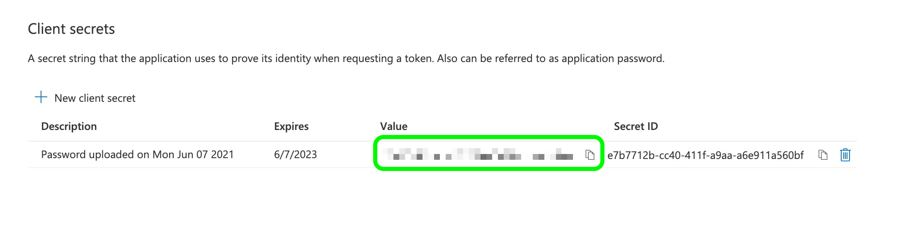
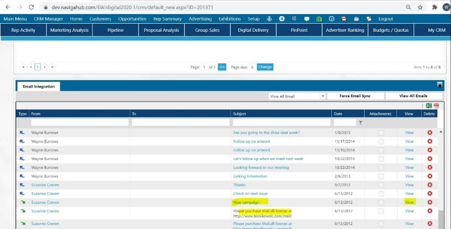
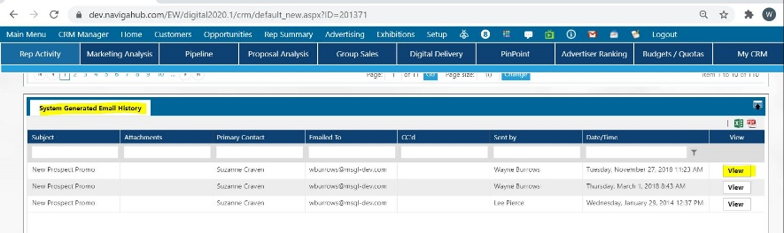

# Nylas Email/Calendar Integration

The purpose of this document is to clarify how the Naviga system provides an interface for synchronizing email messages and calendar action items of G-Suite, Office 365, or Microsoft Exchange. Note that G-Suite is the business suite including Gmail, Calendar, Photos, Google Docs for businesses. Email data is loaded from the mail app into the Ad system based on the email addresses for "My contacts" in CRM module. Calendar items created in the system are automatically moved into the mail app. Changes to calendar items previously synchronized are automatically copied to CRM or the mail app depending on the most recent change date and time.


Note that Email Integration through Nylas requires a license - see your sales rep for a quote if you are interested in starting to use this feature. If you are unsure who your rep is, put in a support ticket and we will help get you connected to the right person.


## Overview – NYLAS Integration 

Naviga is using the third-party service Nylas to facilitate the synchronization between your CRM emails and calendars on G-Suite or Microsoft. The Nylas API provides the synchronization service to allow you to create, read, update, delete emails and calendar items.

Currently we support only G-Suite, Office 365 and Exchange Configurations (Exchange does have some caveats)


**Note that this process allows Nylas to retain a copy of all your emails and calendar item details on Nylas systems.**


For more details on security and integration, please refer to the Nylas website and documentation at this website: [https://www.nylas.com/](https://www.nylas.com/)


**IMPORTANT NOTE:** The NYLAS software is setup and maintained by NAVIGA, there will be links to NYLAS in this document but only for the sake of creating and configured your G-Suite and Office applications to talk to NYLAS. Again – you will have no direct interaction with the NYLAS software, this falls on the Naviga Team.


## Workflow 

Here is a run through of process to get your system configured to integration with Naviga Systems

1. Customer sets up O365/G-Suite using the instructions provided by NYLAS (links provided below in this document)
2. Send Naviga the Client ID and secret key value from setup
3. Naviga Keys in those credentials in NYLAS – NYLAS is managed completely by Naviga
4. Naviga takes the NYLAS application and keys that information into Naviga Application
5. Customer goes to User setup in the system and authenticates via CRM Email window, this initiates the Sync from your Mail system to NYLAS.

## **Data flow** 

* User initiates Authentication from Naviga Ad – log in through O365/G-Suite/Exchange as prompted/normal
* This creates a user acct in NYLAS
* NYLAS syncs Inbox and sent items from the users email – these folders can be specified on the CRM – User window in Naviga Ad – 30 days back from the creation of the user account (This setting is in NYLAS)
* Naviga Ad – Then pulls (syncs) emails from the a) User b) User's "My Contacts" on the accounts
* Saves those to Naviga Ad where they are viewable based upon the permissions on the users in the system.

## Setting up G-Suite 

[https://developer.nylas.com/docs/developer-guide/provider-guides/google/create-google-app/](https://developer.nylas.com/docs/developer-guide/provider-guides/google/create-google-app/)

**Again, a reminder** – you will **not** log into NYLAS. Follow the link in Google to create your application. The first thing they ask is if you are doing a Hosted or Native Application. We are doing hosted.

The next thing they ask; and it is specific to Google is if you are doing an Internal or External Application. At the part where you need to choose internal or external for the user type, you need to choose **internal**.

In all cases we need back from your G-Suite Setups

CLIENT ID SECRET KEY

## Setting up Office 365/Azure 

For Microsoft the setup is a bit different and there are no certification requirements:

Creating an Azure Application

[https://developer.nylas.com/docs/the-basics/provider-guides/microsoft/create-azure-app/](https://developer.nylas.com/docs/the-basics/provider-guides/microsoft/create-azure-app/)

Pay attention to the permissions mentioned – see below for the common settings that you need to configure.

### CLIENT ID 

Please pay close attention to the documentation in the link it really does have the information you need. Here are some items that usually come up:

This is the Client ID.

.png>)

**SECRET KEY VALUE** – you only get one shot to write this down, it is NOT the secret ID

<figure><figcaption></figcaption></figure>

Other important settings Allow Token Exchange

.png>)

Set to Multitenant.

.png>)

**OAuth – Callback URL:** https://api.nylas.com/oauth/callback

<figure><figcaption></figcaption></figure>

### **Microsoft EXCHANGE**

If you are using an on-premise Exchange installation:

Exchange does not offer a setup or integration like the G-Suite and Office 365 Cloud. NYLAS forwards you based upon the users’ email domain the best that it can.

There is no ID or KEY to send to Naviga in this case.

The user is presented with options to log in and authenticate.

NYLAS does the best it can to facilitate between exchange.

They might have to use the advanced setting link to type in their exchange URL.

[https://developer.nylas.com/docs/the-basics/provider-guides/microsoft/microsoft-exchange-login/#advanced-settings](https://developer.nylas.com/docs/the-basics/provider-guides/microsoft/microsoft-exchange-login/#advanced-settings)

[https://developer.nylas.com/docs/support/troubleshooting/microsoft/authentication/](https://developer.nylas.com/docs/support/troubleshooting/microsoft/authentication/)

.png>)

.png>)

## User Setup–CRM Email Integration 

These screens enable you to activate the synchronization feature.

User Security Screen:

.png>)

User [Profile Screen:](../../advertising/setup/my-security-user-security.md)\\

<figure><figcaption></figcaption></figure>

* Enable Email Sync – Set to yes, if email synchronization is desired.
* Email Folders(s) – If specific email folders are not specified here, the synchronization process syncs emails in the Inbox and Sent folders. If different folders are required, they should be specified here. If the Inbox and Sent folders are also required, they must be specified in addition to the other folders\*\*. It is recommended to leave this field blank.\*\* The reason is that if user moves emails to the specified folder in their mail app, and the synchronization timestamp is past the email date, this email will not be synchronized into the system.
  * Separate folder names with “;”.
  * For “Email Folders”, there is no need to have the full path to the final folder. Despite what the user sees on the screen: /folder/subfolder/sub-subfolder, the only folder that user should enter Naviga system’s Email sync setup is the final folder in the format of “sub-subfolder”. For example, if user has one sub folder to sync: Inbox\CoolStuff, then Email folder field should contain CoolStuff

Or if user has two sub folders I want to sync: Inbox\CoolStuff; and Inbox\NotAsCoolStuff then the field should contain CoolStuff;NotAsCoolStuff

If user has three subfolders to fill in: Inbox\CoolStuff; Inbox\NotAsCoolStuff; and Inbox\Awesome, then user should fill in the field to say CoolStuff;NotAsCoolStuff;Awesome

* Folder names are not case sensitive, but naming must be an exact match. G-Suite displays “SENT MAIL” however the exact match on this folder is **sent**.
* User Name / Email Address: This is where the user email address or user name can be entered and it doesn’t have to be the same email address as the user’s email in Naviga; it can be a different email for G-Suite or Microsoft email.
* Connection Authorized: Once you click the button to authorize the synchronization, the system initiates the synchronization through NYLAS directly to your Mail system. If you are using G-Suite you should be redirected to Google to log in and authenticate. If you are using Office 365 – it should take you to the Office Login page etc. This is typically where the setups will fail if everything is not setup properly. This is a one-time step, not to be repeated for synchronization.
* Enable Calendar Sync – Set to yes, if calendar/action items synchronization is required.
* Sync Days before Today / Sync Days after Today – Please disregard these fields as they are no more applicable to the system. Previously in older releases, these defined the number of days before the current date and after the current date that the synchronization process should use when selecting new and changed action items for synchronization with the Mail App. When the _before_ parameter is changed, the Calendar Synchronization From date/time is changed to the current date less this parameter.
* Calendar Name: This is the calendar name only in case of using Microsoft.

## **Whose emails can a user see?**

<figure><figcaption></figcaption></figure>

### Email Synchronization 

The system automatically searches the emails in the folders defined in the user parameters for any email with a To, From or CC email address matching the email addresses of the user’s "My Contacts" in CRM prospects and customers. Only emails dated on or after the Users Email Synchronization Initial Authorization date/time which have not yet been loaded into CRM are selected by the system and automatically moved into the system CRM.

Naviga Configures NYLAS to only sync 30 days prior to the date in which the users authenticated from. If a user Authenticates “today” – it will load all emails from the sent and inbox 30 days prior and currently into NYLAS. The initial sync might take some hours depending on the quantity of emails but from there forward the system will sync on a schedule and load any new emails quickly once the initial process is complete.

Note that the system recognizes if your email account contains emails which are not sent to and from **your** CRM contact, they won’t be synchronized into Naviga. Only email exchanges and threads of emails between you and your CRM contact will be synchronized between Naviga CRM and your email account. Even if the contact person exists in the system, but is not "my contact", it will not be sync'd, so be sure to appropriately flag contacts which you would like to sync.

User can then click on the hyperlinks of emails in CRM to reply, delete or view. If user clicks the subject line, the email app will start. If user clicks the view hyperlink, a popup screen will display with the email. Click the “to” hyperlink and the mail app will pop up.

Attachments will not be viewable from the hyperlinks.

If user deletes emails from CRM, the emails will **not** be erased from the email app.

Note that if user generates an email from their email application to a client (email does not originate from the system), it would still sync with the system, so long as the email address of the contact used for the email is linked to that contact in the database and the email is stored in one of the folders specified for the sync (inbox and sent are defaulted).

On the other hand, if the email is sent from the system, it will not populate the Salesrep Sent folder, but will appear in the section "System Generated Emails" on the Account record.

## Automatic Synchronization 

The G-Suite interface requires that you make a setting change to your google account. If you go to Sign-in & security, you must set it to allow for less secure apps.

.png>)

### View Emails 

The emails display in the advertiser’s customer overview screen under the Email Integration shutter.

.png>)

The emails can be viewed by clicking the View hyperlink button.

As a CRM Manager, navigate in CRM to the menu Rep Activity -> Scroll to the shutter My Reps Activity. Click the hyperlink count under the Email tabs.

.png>)

This displays the emails synchronized with the external email address.

## Calendar Synchronization 

New calendar items created in CRM will be synchronized with the Mail App calendar.

On the User Security screen, click the button “Enable Calendar Sync” to “Yes”. The synchronization happens according to the days set as before and after today. So, if there is a calendar entry outside this range added or changed, it won’t be synchronized.

The Calendar Name defines which calendar on your accounts you’d like to be synchronized with the Naviga calendar. If the field is left blank, the system searches for the first calendar with the name **Calendar** and uses it to synchronize. If no calendars are named “Calendar” then the system synchronizes the first calendar it encounters on your list of calendars.

When you open an action item you can see the calendar related to that item. Form the Customer Overview screen, scroll to the “New To-Do” button and click it.

.png>)

Note that you must click the button Sync to set its value to “Yes” for this item to synchronize with your calendar. The Short Description field entry will then appear on your Calendar in your Calendar app. Depending on the Action Type selected, the Sync setting might already be defaulted to Yes or No accorning to the [CRM System Settings](../../crm/setup/crm-system-settings.md#\_toc120632528).

Any update to either calendar item on Naviga CRM or on your Calendar app is reflected on the other one.

Note that the synchronization on the Calendar app won’t automatically schedule an appointment with your contact or notify this contact of any meeting, but it only serves as a reminder to you of an action item. You must add the contact name and contact information in the Action To-Do item to have this information in the action item.


Note also that Nylas does not support reminders, so that when you create a To-Do Action item in CRM, even if you mark the reminder button, this reminder will not appear in your app for calendar.

Also, note that if you create a reminder in your calendar app, it will not automatically display in CRM. This is a one way integration for new items from CRM to your calendar app.


## INTERNAL Components for Naviga Support 

### Windows Service 

For the synchronization to happen, the Windows Service must be running at all time. Navgia IT will set this section to be running in the Admin screen.

.png>)

Scroll to the Outlook Web Access section.

.png>)

Enable Outlook Web Access Processing by setting the flag to “Yes”.

Enter the number of minutes after which the synchronization takes place. Recommended to set this at 5 or 10 minutes, if you do 1 minute, it will be syncing everyone’s email every minute and it bogs down the sync process.

## Troubleshooting 

### Google Won’t Sync 

It isn’t recommended to perform a manual synchronization in CRM the first time you connect synchronization of email and calendar, because this will take up hours and occupy the user’s machine in synchronizing Naviga with the other systems.

If the CRM Salesrep has been emailing a prospect or client, only after the Salesrep creates this contact in CRM and starts synchronization, the system will display the new emails synchronized with this contact. The system will not retrieve emails older than the synchronization date with the contact in CRM.

The synchronized emails do not include the system generated emails such as AR Statements, and Invoices.

Note that if a Salesrep has been communicating and synchronizing his email with a CRM contact, then this Salesrep leaves the company and his contacts are moved over to another Salesrep, the new Salesrep will not be able to view the older emails between this contact and the previous Salesrep who left the company. Synchronization for the new Salesrep begin only when he starts synchronizing his email with this contact so that only his emails to and from this contact display for him on his email and on CRM.

The system returns error when synched and user receives this message when connecting: “A suspicious app was blocked from accessing your account.”

Naviga Ad does not have control over this; this is due to Google security settings. Click “Yes, it was me” to verify it is you.

.png>)

G-Suite users

1. Click the gear icon toward the upper right of the G-Suite window.
2. Click on the 'Settings' link.
3. Check 'Mail notifications off' under the Desktop Notifications section.
4. Click Save.\
   .png>)
5. Click “Allow less secure apps: ON”.

### Calendar Won’t Sync 

If you use multiple calendars the path must be set OR set the default calendar on your system.

For Microsoft, if multiple calendars are used (iPhone/Mac, etc.) you must set the path as the system assumes the default, and if the default is currently not the outlook calendar, the sync may not work, so you must define the path as follows:

#### **Using a Mac – Set the Default Calendar**

Go to ICal / Calendar on the Mac

On the menu bar choose calendar > preferences

On the general tab in there is an option for default calendar

Make sure the default calendar is the Exchange calendar

#### **Using iPhone – Set the Default Calendar**

Go to Settings > Calendar

Default Calendar > Place the check box on the default Outlook/Exchange calendar location

#### **Outlook – default Path**

File > Account Settings > Account Settings > Data Files tab.

This is the location and then you can list the calendar name.

.png>)

## Notes on User Email usage 

* The system automatically searches emails in the folders defined in user parameters for any email with a To, From or CC email address matching the email addresses of the user’s "My Contacts" in CRM customers.
* Only emails dated on or after the Email Synchronization From date/time which have not yet been loaded into CRM are selected by the system and automatically moved’.

_(Note that it takes time to synchronize in the background depending on the number of emails)_

* User can then click on the hyperlinks of emails in CRM to reply, delete or view.
* If user clicks the subject line, the email app will start.
* If user clicks the view hyperlink, a popup screen will display with the email. Click the “to” hyperlink and the mail app will pop up.
* If user deletes emails from CRM, the emails won’t be erased from the email app.

_Note that if user generates an email from their email application to a client (email does not originate from the system), it would still sync with the system, so long as the email address of the **contact used for the email is linked to that contact in the database** and the email is stored in one of the folders specified for the sync (inbox and sent are defaulted). On the other hand, if the email is sent from the system, it will not populate the Salesrep Sent folder._

Naviga Ad System generated emails (things we send out that show as history on the account) that are sent through our software that do not have a trail to your email application.

Here are some screenshots showing this:

## Notes on Calendar usage 

New calendar items must be created in CRM to be synchronized to the Mail App calendar provided the following conditions all present:

* The action item was flagged for synchronization at entry time.
* The action date/time is on or after the Calendar Synchronization From date/time.
* The action date/time is on or before the current date plus the “to” days defined in the user parameters.

Calendar items changed in CRM are updated in the Mail App calendar provided the following conditions are all present:

* The action item was flagged for synchronization at entry time.
* The action date/time is on or after the Calendar Synchronization From date/time.
* The action date/time is on or before the current date plus the “to” days defined in the user parameters.
* The system items change date/time is more recent than the Mail App items change date/time.

Calendar items changed in the Mail App calendar which originated from CRM are updated in CRM provided the following are all true:

* The action date/time is on or after the Calendar Synchronization From date/time.
* The action date/time is on or before the current date plus the “to” days defined in the user parameters.
* The Mail App item change date/time is more recent than the system action item change date/time.

When user completes a calendar item and deletes it in the system, it will be removed from the mail app calendar.
