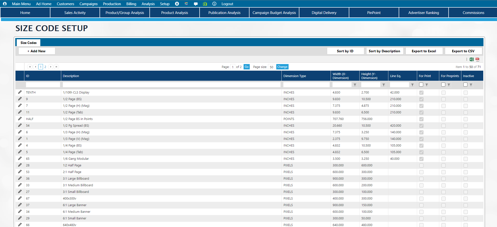

# Release Guide

<figure><figcaption></figcaption></figure>

**These are the most important takeaways / impactful changes that you **_**need**_** to pay attention to:**

* There is a new workflow option for Inserts / Preprints.  The older workflow will still be supported, to ease the transition, but we think many of you will want to take advantage of this new workflow. [See below for details](release-guide.md#new-workflow-option-for-inserts-preprints)
* There are a couple new Group Security Changes in both [Advertising ](release-guide.md#group-security-change)and CRM modules

## Advertising Module

### New workflow option for Inserts/Preprints

In 2023.6 there is a new option for setting up, pricing, and managing preprints, which allows for varying page types with page counts, weights and spoilage.  It isn't required that you implement this workflow - if you do not set up the following you will still be able to use preprints the old way, though we do think this way will be appealing to many of you.

#### Prerequisite Setup

#### Size Codes

**Setup -> Advertising Setup -> Size Setup.**  Size Codes are not a new concept for this release, but there is a new field on the size code setup. For any sizes that are to be used in the new Inserts workflow, the flag "For Preprints" should be set to yes.  In addition, only dimension types of Inches, Millimeters, Centimeters, or Points should be used on these, since the digital dimensions wouldn't be relevant.&#x20;

<figure><figcaption></figcaption></figure>

#### Page Types

Navigate to Setup -> Advertising Setup -> Page Types.  Setup one or more page types as needed for the types of inserts/preprints that you offer.  Page types will set defaults for weight and spoilage %. You may also have certain metadata questions that need to be answered and possibly passed on to the printer to allow them to print the insert properly.

<figure><figcaption></figcaption></figure>

1. Click New to create a new Page Type
2. Enter a desired ID and Description for the Page Type
3. Optionally, select a default size code.  This can also be manually added / changed on an order
4. External ID - Optional - This doesn't have a function inside of Naviga Ad, but may be included on a feed to the printer.
5. Is Inactive - set this flag to yes if you no longer wish to use a Page Type

**Page Options** - Add as many lines as needed for the given page type.  Enter the page count for each line.  These will be the valid page counts allowed when booking an order.  For each number of pages, set the default weight and default spoilage percent.  These two can be overwritten in order entry if a given insert differs from the default.  Each line can also have an override External ID, or this can be left blank it is shares the same External ID as the Page Type itself.  This is optional and only used in external feeds.

**Custom Fields** - much like the metadata in classified order entry and custom forms setup elsewhere in the system, the custom fields tab on Page Type setup allows the system admin to set up certain questions that the order entry user can (or must) answer before saving the order.

<figure><figcaption></figcaption></figure>

* Enter a Label / Question &#x20;
* Select the prompt type from the dropdown
* If appropriate for the prompt type, enter validation information (used with single line text, multi-line text, and dropdown list)
* If available, based on the prompt type, select formatting from the dropdown (used on dates, date ranges, number and number ranges)
* check the required flag if the user is required to answer the question before saving the order.&#x20;

#### Ad Type (Preprint Types)

Navigate to **Setup -> Advertising Setup -> Ad Types**. Like Size Codes, Ad Types are not new, but there are some new settings related to the new Inserts workflow.

<figure><figcaption></figcaption></figure>

Click Ad New at the top of the Ad Type screen, or select an existing Ad Type to edit with the pencil icon.  Each ad type for the new workflow should include the following:

* Ad Type ID
* Ad Type Description
* G/L Type
* Line Type (not actually relevant to these, since the rate type will be defined elsewhere. Cost per Thousand is the default new line type - can leave it at that if desired)
* Is for Preprints flag - set this to Yes.  This is important as it is the trigger to open the new preprint workflow screen rather than Full Line entry.
* Linked Products - Select the products which allow this Ad Type. Only required if you restrict certain ad types to certain products.  Can also select ad types during product setup if desired.
* Page Types (Preprints/Inserts) tab - _**Optional**_ - can set allowed Page Types for this Ad Type. If none are selected, all page types will be available in order entry for this Ad Type.

#### Insert Rating Schedules

**Navigate to Setup -> Advertising -> Insert Rating Schedules**

The new inserts workflow does not use the standard rate cards that other kinds of ads use.  This uses a rule-based engine that determines which price to use based on how closely it matches one of these definitions.

Click New to create a new schedule and give it an ID and a Description.  There is an inactive flag as well in case you wish to no longer use it at some point in the future.

#### In the Basic Settings section:

<figure><figcaption></figcaption></figure>

* select the Price Type to be used.  Options include Quantity based CPM, Quantity Based, or Flat Rate. &#x20;
* Optional - Enter a Start Date and Valid through date to limit when this rate can be used.
* Priority Code - The appropriate schedule is chosen by the system based on the number of matching qualifiers.  For example, there might be multiple schedules that could potentially be used in order entry.  One schedule might match on just one qualifier, and another one might match several qualifiers. In the event that two rate schedules match on the same number of qualifiers, the priority code will determine which schedule to use.

#### Qualifiers

<figure><figcaption></figcaption></figure>

There are currently 7 attributes or qualifiers that can be checked to determine which rate schedule to use.

1. Specific Advertiser - Select a specific advertiser if the advertiser has negotiated a custom price
2. Page Types - Select one or more relevant page types for this rating schedule
3. Product Group - If applicable select a product group that this rating schedule is valid for
4. Product(s) - Select one or more allowed products for this rating schedule
5. Client Type - Select a client type that is allowed to use this rate schedule
6. Ad Type(s) - Select one or more ad types that can use this rate schedule (Note these ad types are filtered to only ad types flagged with the "Is for Preprints" flag
7. Matching Days of the week - Select one or more days of the week which can use this rating schedule.

#### Price Escalations&#x20;

<figure><figcaption></figcaption></figure>

For each Rate Schedule, you can have one or more sets of prices that can be used, based on the number of pages (which also links to weight based on Page Type Setup) and number if inserts.  These prices can be flat prices, per insert prices, or per thousand prices based on the Price Type selected in the Basic Settings section. &#x20;

* Select Add New Escalation or click the pencil icon to edit an existing one
* Alternatively, Click copy escalations from another schedule to save some time and copy and edit from a similar schedule.

<figure><figcaption></figcaption></figure>

#### End User Experience

An end user booking an order with this new workflow will begin on the Line Items tab and select a Product and an AdType, as they normally would for a full line entry order.  The Ad Type, if it is one that is flagged in setup as being for Preprints, will trigger the new workflow rather than traditional full line entry

<figure><figcaption></figcaption></figure>

The Insert / Preprint Booking workflow window will open and several tabs can be seen across the top, similar to the Booking Wizard for Classified:

<figure><figcaption></figcaption></figure>

#### Product Selection

Product and Ad Type are filled in based on what was selected in the prior screen, though it can be changed here if desired.

Page Type must be filled in as it is what drives page counts, weights, spoilage, metadata questions and possible the rates on later screens.

Sections and positions are optional, and section could potentially drive rate selection later if setup as such.

First / Primary Issue Date is when the printing and billing will be done, and all pricing will be based on that date.

Additional (perpetual) Issue dates are not going be relevant for all inserts.  If it is a flyer for instance where the insert itself changes each week, those would only have a single issue date.  If a campaign for flyers needed multiple dates, there can be multiple lines on a campaign, each with their own issue date. You can also copy the original line and modify the date.  The Perpetual Issue dates are used when the printing of the insert is all done up front for the first drop, but then extra copies are saved for future drop dates when the insert will be delivered.  The important thing to understand here is that all the printing and billing happens on the first date.

#### Zone Selection

From there the user clicks "next" to select Zones.

<figure><figcaption></figcaption></figure>

Several different methods are available for selecting Zones

* User Selects Zones from Grid
* User imports the desired Zones.
* User Selects Zones from Map

#### Selecting Zones from the Grid

This will be familiar if you are already booking inserts using Zones in the other workflow.  There is a breadcrumb trail at the top to jump up to higher levels once the user begins drilling down.  This is a view from the highest level grouping (Philadelphia Metro in my system)

<figure><figcaption></figcaption></figure>

Based on the blue squares, user can see that some HD routes were selected (HD=Home Delivery in my system, these names are configurable in Zone Dimension Setup), some SC routes were selected, and All of the Retail Outlets were selected in the Zone Group "Outer Suburbs"  In the Philly City Group, nothing was selected for this order.

Drilling down into Outer Suburbs additional Zones and/or Zone Groups can be seen

<figure><figcaption></figcaption></figure>

Once all selections are made, the user can click apply to save and close the window, or for additional selections in higher groups, user can select desired group in the breadcrumb trail at the top.

After clicking apply, the user returns to the Zone Selection tab and can see the selected Zones, and their counts for each date selected on the Product Selection tab.

#### Importing Zones

Using the same grid view from above, instead of selecting zones from the boxes as shown from example 1, the user can also import the selections.  Select "Import Selections" button at the bottom of the screen

<figure><figcaption></figcaption></figure>

User can copy and paste from excel, text file, or just manually type in Zone ID's.  These can be a list, like shown in the screenshot above, or it could be comma separated.  I would use the select, to select only certain zone ID's, and select one or more dimensions to select.  To use the deselect, I might select an entire Zone group in the previous screen, but then list just a handful of exceptions in this list to exclude only a few from the overall group.

Click Apply to save the selections and only the selected Zones will be displayed

<figure><figcaption></figcaption></figure>

Click apply again to return to the Zone Selection tab

#### Use Map to select Zones

The final option is to select zones from a map with a radius of available zones from the customer's address.  On the Zone tab, the user selects the button "Use Map to Select Zones" and a google map will appear

<figure><figcaption></figcaption></figure>

The customer's address will be displayed, though user can override that with a different address.

The default radius is 5 miles, but that can also be overridden by the user to have a larger or smaller area.

User selects Get postal codes to get all the postal codes in the radius area.  Any postal codes which match a defined Zone in the Product Setup will be pre-selected in the list. (this uses geo-coding, so on product setup one must get lat/long coding for the zones).

Finally, user selects the yes/no flags for the desired Zone Dimensions (HD, SC, and Retail in my sample system setup)

User clicks Use Selected Zones to save selection and return to the Zone Selection screen with the selected Zones displayed.

<figure><figcaption></figcaption></figure>

Click next to proceed to the Inset Details

#### Insert Details

<figure><figcaption></figcaption></figure>

* Pages - select desired number of pages for the insert.  Available numbers here will be based on the Page Type setup
* Total Weight - this will default based on the pages selected and the page type setup.  Can be overridden by the user
* Spoilage Percent - again will default from the Page Type and # of Pages selected, but can be overridden by the user.
* Total Distribution - not editable - this is the quantity from the Zone selection on the previous step
* Size Code - Default based on the Page Type Setup.  Can be overridden by the user to another size code.  Only Size Codes flagged as being Insert/Preprint Size codes will be in the dropdown.  May be further filtered by Size Codes allowed on the product.
* Spoilage Qty -  Calculated field equal to the Total Distribution \* Default Spoilage % - can be overridden
* Base Print Qty - Equal to the Total distribution plus the Spoilage
* Optional Metadata fields - if custom fields were configured on the page setup, they will be displayed here, and the user can answer the questions

Click next to continue to overruns

#### Overruns

This optional tab is used if there are any overruns requested on on the order.  These overruns may or may not be charged to the client, but will affect the total quantity needed from the printer

<figure><figcaption></figcaption></figure>

There is no rate setup in the background for this.  The user simply types in the information based on the agreed upon price with the client.  Overruns will create additional line items on the order, so Ad Type is important, to properly charge for it and have it map to the correct G/L.  the Ad Type drop down will only display CPM, FF, or CPU line types.

A CPU ad type will calculate the Price by multiplying Qty \* Rate

A CPM ad type will calculate the Price as Qty \* Rate / 1000

A FF Ad type will disregard the Qty in the price calculation and the Price will equal the rate

Click ok and select next to enter adjustments (if applicable)

#### Adjustments

<figure><figcaption></figcaption></figure>

Enter one or more adjustment codes as necessary (optional) and click next

<figure><figcaption></figcaption></figure>

#### Price and Book

Most of the fields on this final screen are read only.  Only the Billing Quantity can be edited here. There is a "Price it out" button at the top to re-calculate the price.  Generally this isn't needed, but is there in case there is a price change that didn't automatically calculate upon opening this screen.  There is a "Show Rate Selection" button as well which will display which rate was chosen and why (See [Insert Rating Schedules](release-guide.md#insert-rating-schedules) for info on how we determine what rate to charge).

<figure><figcaption></figcaption></figure>

Click Finish to save the order,

One order line will be created for the Primary Issue and any Perpetual Issue dates set on the Product Selection tab (again with all the revenue being tied to that Primary issue date), and one order line will be created for EACH Overrun line.

#### Post Billing user experience

Once the line has been invoiced, the user experience will differ slightly.  The order will still open up in this wizard-like workflow, but the user will see that the order has already been billed and limited information will be editable at this point.  Nothing that affects pricing will be editable.

**Product Selection Tab -** nothing on this page is editable after billing has started.  User can click on the link in the red bar at the top to view the associated invoice. (or it is also available on the campaign Invoices and Payments node, as always)

<figure><figcaption></figcaption></figure>

**Zone Selection Tab -** nothing on this page is editable after billing has started. &#x20;

<figure><figcaption></figcaption></figure>

**Insert Details Tab -** This page allows editing of the weight and the metadata. &#x20;

<figure><figcaption></figcaption></figure>

Overruns Tab - on the overruns tab, no new overruns can be added and within an overrun, only the description and delivery address can be edited after billing.

<figure><figcaption></figcaption></figure>

**Adjustments Tab** - Nothing on the adjustments tab can be edited post-billing.  If adjustments are needed after billing, Post-Billing adjustment tickets should be the workflow used to request an adjustment.

**Price and book Tab -** Nothing on this tab is editable after billing. User can click on the Show Rate Selection button to see what rate was selected (and if there were other possible matching rates that were not selected.)

<figure><figcaption></figcaption></figure>

###   Filter for easier GAM GeoTarget searching

There is a new dropdown field in the geotargeting field on campaign entry

<figure><figcaption></figcaption></figure>

Selecting what you are searching on in the dropdown will filter the list to better match what you are looking for and cut out some extra matches

<figure><figcaption></figcaption></figure>

Options include filtering on City, State, Province, Country and more

<figure><figcaption></figcaption></figure>

### G/L Override by Client Type

A new column has been added in the G/L Overrides node in Product Setup

<figure><figcaption></figcaption></figure>

Now the G/L selected for each G/L Override can vary based on the client type of the advertiser.  To create a new GL Override, click the button "Add an Override" and a popup window will open:

<figure><figcaption></figcaption></figure>

G/L Type, Revenue G/L Code and Agency Commission G/L code are all required fields.&#x20;

Client Type is only necessary if you choose to use this feature.

Cost G/L and Cost A/P G/L Code are only required if you choose to put cost information on the campaign lines and have them affect G/L mapping. (This was a new feature in [2023.1](https://docs.navigaglobal.com/navigaad/v/advertising/welcome-to-naviga-ad/release-guide#\_toc124253160))

### Group Security Change

New flag added to disallow campaign status change from R back to Q.  If you set this option to Yes, it will prevent users in this security group from reverting campaigns in any Reserved status to Quote status manually or through the Bulk Update Process.  You might want to consider setting this to yes if you have integrations with downstream systems that send the ad somewhere else when the order becomes reserved.

<figure><figcaption></figcaption></figure>

### Fields added to several screens

Advertising Client Type and Prepay Required added to the Client overview screen:

<figure><figcaption></figcaption></figure>

Client Type added to the Invoices & Payments node on a campaign:

<figure><figcaption></figcaption></figure>

Client Type added to popup when changing the advertiser on a campaign (on a campaign, select edit -> change Advertiser to see this popup):

<figure><figcaption></figcaption></figure>


If you don't see the option to change the advertiser, remember in 2023.4 this was added to group security so a user must have permission to be able to change the advertiser on a campaign.


Client type (ID and Description) added to the Report **Customers -> Advertiser Listing**

<figure><figcaption></figcaption></figure>

Prepayment Required Flag added to the Account Approval Screen:

<figure><figcaption></figcaption></figure>

Two new columns has been added to the Payments tab on the Accounting screen of the Customer account overview. This will display the Cash on Account reason and any comment entered when applying payments.

<figure><figcaption></figcaption></figure>

Advertising Home screen - Campaign Tab - added Campaign Description to the grid here:

<figure><figcaption></figcaption></figure>

Client Type added to the Agency field dropdown on Brand Detail screen (**Customers -> Brand -> Brand Maintenance**):

<figure><figcaption></figcaption></figure>

Fields added to Orders by Product Report: Material Description, Campaign Entry Date (click on Configure output tab to choose which columns to display):

<figure><figcaption></figcaption></figure>

## CRM Module

### Group Security Change

New Flag in Opportunities which will allow for a single opportunity to cross multiple product groups, and when the proposal is auto-generated, there will be multiple proposals/campaigns created - split by the primary product group on product setup.

<figure><figcaption></figcaption></figure>

## Accounts Receivable Module

### List of Imported Payments

Minor makeover on the List of Imported Payments.  Navigate to Payments -> List of Payments -> List of Imported Payments. Note that the Company ID has been added as a new column and there is now a row of filters at the top of the columns.

<figure><figcaption></figcaption></figure>

### Logo for Receipt

Receipt templates can now be setup to include the logo from the bank. &#x20;

To Setup:

1. Add the bank's logo to the Advertising invoice logos
   * Navigate to **Setup -> System Tables Setup -> Invoice Form Logos**
   * Enter ID, Description, and upload file
   * Click + to add to logos and click save.
2. Link the new logo to the bank setup
   * Navigate to Setup -> System Tables Setup -> Bank Setup
   * Select the desired bank
   * Select the new logo from the logo dropdown\
     .png>)
3. Add tag #BANK\_LOGO\_URL# (image) and/or #BANK\_NAME# (Name of the Bank) to the receipt template in desired location.\
   In my sample, I have placed them here:\
   .png>)

Logo will be displayed on the Receipt:\

<figure><figcaption></figcaption></figure>

## Advertiser Portal

### Mark Inactive/Delete Profiles

Two new functions are now available in the Advertiser Portal setup.  For any profile that you no longer wish to use you may mark it as inactive:

<figure><figcaption></figcaption></figure>

&#x20;If the Profile perhaps was created in error, or you are certain you no longer wish to use it, the profile can also be deleted by scrolling to the bottom of the page and clicking delete:

<figure><figcaption></figcaption></figure>

<mark style="background-color:green;">NEED TO ADD SOME MORE INFO AROUND THE BEHAVIOR OF WHAT THESE DO - AD2-6138</mark>

***


 In 2022 we introduced the idea of a Customer Enhancement Portal, where you all get to add feature requests, look at feature requests submitted by others, add comments, and vote on things you would like to see us implement in the system. Items that were voted up in the Enhancement Portal will have this check mark next to the feature in the release guide.

  Click on the Video Icon in the heading to be directed to the release video page.  Topics that were included in the release video will display this icon.

 In 2023 we introduced a new learning subscription program called NavigaYou. Part of that program are some custom development hours. Any new features that were part of someone's NavigaYou will be highlighted as such with this icon. See [WEBINAR ](../videos/naviga-ad-video-library/conferences-and-webinars.md#navigayou)for more info on NavigaYou


